# 通用神经网络处理器下的多核切图与调度：
# 基于同步层次分层的无环划分与组合式局部搜索

---

## 摘要

多核 NPU 调度要求把一张算子–张量二部计算图划分为若干子图、把子图分配到 $N$ 个同构核心、并确定每核的子图执行顺序，在数据依赖、片上 L1/UB 容量、四条指令流水线与共享 DDR 带宽的耦合约束下最小化总体执行时间 Makespan。本文以**官方评估程序的行为**为唯一事实基准，建立可计算、可复现的模型与算法，完整求解三个问题。

**建模方面**，本文首先对官方评估器做逐行反向解析，形成《评估器机制说明》，并据此发现一条决定性的隐含约束：核内调度 Step3 对"申请片上张量的算子"施加**全局申请序**，只有申请序队首者可以发射。于是一个排在核内序列前部、数据尚未送达的跨核 `COPY_IN` 会让**整个核心的四条流水线同时停摆**，其代价远超配置中 500 cycle 的名义同步延迟——实测单次停摆可达 $7.1\times10^5$ cycle。围绕这一发现，本文提出**跨核同步层次**

$$r(v)=\max_{u\to v}\bigl(r(u)+\mathbb 1[c(u)\neq c(v)]\bigr),$$

并以**子图 $=(\text{核心},\text{层次})$ 等价类**作为切图的构造性定义。该定义在数学上保证：(i) 按 $(r,c)$ 编号即为子图商图的一个拓扑序，题目全部 9 条硬约束自动满足；(ii) 同一层次内不存在跨核边，同层各核子图完全独立；(iii) 每个核上依赖远端数据的算子被自动推迟，核内先执行全部本地就绪工作，从而最大程度掩盖跨核同步。

**算法方面**，本文设计四阶段求解框架 **CAP-LS**（Communication-Aware acyclic Partition + Level stratification + Local Search）：S1 以"张量扇出阈值 $\theta$"区分强连接与广播连接，做亲和原子化、SCC 合并与 $\sigma$ 连续区间分块；S2 以每核四条 Pipe 负载、DDR 字节数与同步深度的复合代价做 LPT 装箱与 $O(|T_b|+m)$ 增量移动式局部搜索；S3 做同步层次分层与规模切片；S4 以参数网格做多起点组合，由官方评估器择优。三个场景共用同一框架，只在 S2 的代价权重与 S3 的子图粒度上切换。问题 3 进一步把"命中字节按 250 B/cycle 折算"写进分配代价，使跨核重复读取从"必须避免"转变为"可以承受"。

**实验方面**，在官方给定的全部 100 个测试用例与固定配置下，用官方评估脚本完成 10,780 次评估。CAP-LS 在 $N=2,3,4,5$ 下的平均加速比（几何平均）为：问题 1 1.00 / 1.71 / 2.36 / 2.91 / 3.28；问题 2 1.00 / 1.79 / 2.53 / 3.12 / 3.56；问题 3 1.00 / 1.79 / 2.55 / 3.19 / 3.69。相同切图方案下，只读 L2 相对无 L2 基线的 Makespan 加速比在 4 核时达到 1.023，平均按字节命中率 26.9%。与随机、拓扑等分、负载均衡、通信聚类四类基线相比，CAP-LS 在 4 核问题 2 上的平均加速比分别提升 随机 +189%、拓扑等分 +86%、负载均衡 +107%、通信聚类 +25%。消融实验表明同步层次分层是贡献最大的单一机制（移除后问题 1 的平均加速比下降 20.6%、问题 2 下降 8.1%、问题 3 下降 9.5%）。算法对 $|V_{\mathrm{op}}|\le 3.6\times10^4$ 的最大用例单候选求解时间中位数 0.16 s。

**关键词**：多核 NPU；计算图切分；有向无环图划分；列表调度；共享带宽争用；只读 Cache；局部搜索

---

## 一、问题重述

### 1.1 问题背景

随着 AI 模型规模增长，单核算力受制造成本、功耗与散热限制，多核 NPU 成为主流架构。一块多核 NPU 由 $N$ 个同构 AI 核心与共享片外主存 DDR 构成；每核含 Cube 矩阵单元（`PIPE_M`）、Vector 向量单元（`PIPE_V`）、两类搬运单元（`PIPE_MTE2`：DDR→L1/UB 与 UB→L1；`PIPE_MTE3`：L1/UB→DDR 与 L1→UB），以及私有缓存 L1（512 KB）与 UB（128 KB）。所有核心对 DDR 的读写共享固定总带宽 60 B/cycle。

待调度对象是一张有向无环计算图 $G=(V,E)$，$V=T\cup O$ 为张量节点集与操作节点集，$E\subseteq (T\times O)\cup(O\times T)$。张量含 `pos`（DDR/L1/UB）与 `size`；操作含 `op`、`pipe`、`cycles`。图的输入、输出张量位于 DDR，中间张量位于核内缓存。

硬件结构与本题的固定参数见图 1。

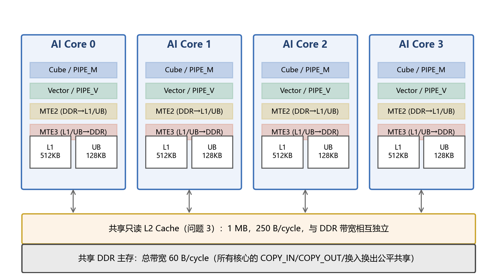

### 1.2 需要回答的问题

多核调度需联合确定三件事：

1. **切图**：为每个非 `COPY_IN`/`COPY_OUT` 的算子指定子图 id；
2. **分核**：把每个子图指派到唯一核心；
3. **同核排序**：确定每个核心上子图的执行顺序。

评估程序据此重建跨子图搬运、用固定的核内调度算法确定 Task 内算子顺序、并在共享带宽下模拟多核并行执行，最终给出 Makespan（主指标）、总额外数据搬运量（次指标）与 Cache 命中率（次指标，问题 3）。

* **问题 1（场景 A，无核间同步）**：一个 Task 只含一个子图，所有跨子图数据必须经 DDR 中转；同核 Task 切换等待 100 cycle，跨核前驱等待 1000 cycle。要求给出 1–5 核的平均加速比曲线与逐用例结果。
* **问题 2（场景 B，有核间同步）**：同一核心的全部子图合并为一个 Task，同核子图可直接复用 L1/UB 数据；跨核依赖通过 `COPY_OUT`+同步延迟 500 cycle+`COPY_IN` 完成。
* **问题 3（共享只读 L2）**：在场景 B 之上加入所有核心共享的只读 L2 Cache（1 MB，250 B/cycle，带宽独立于 DDR），要求研究其容量与带宽对切图与调度的影响，并给出无 L2 与只读 Cache 两种配置的对比曲线。

加速比定义为**官方单核基准 Makespan 与 $k$ 核多核评估 Makespan 之比**，单核基准由核内调度算法在整图上计算，其加速比恒为 1。

---

## 二、问题分析

### 2.1 决策耦合与求解难点

三项决策相互耦合：切图改变子图规模、并行空间与通信边界；分核决定负载均衡与跨核通信；同核顺序影响依赖等待、张量驻留时间与换入换出。减少切分降低通信但压缩并行度、加大缓存压力；增加切分提供并行机会但放大重复读取与 DDR 搬运。

本问题属于**带通信代价的有向无环图划分与调度**，是 NP-难问题族：即便固定通信为零、只做"把任务分配到 $N$ 台同构机器使 makespan 最小"，也已是强 NP-难的 $P\|C_{\max}$；加入 DAG 优先约束后是 $P|\mathrm{prec}|C_{\max}$；再加入通信延迟即 $P|\mathrm{prec},c_{ij}|C_{\max}$。本题还叠加了片上容量、流水线 FIFO 与共享带宽争用。

> **命题 1**　即便把本问题限制到"$N=2$、算子级 DAG 无边、所有算子同 Pipe、
> 无容量与带宽约束、通信代价为零"这一最简特例，其判定版本仍是 NP-完全的。
>
> *证明*　给定 PARTITION 实例 $\{a_1,\dots,a_n\}$，构造一张含 $n$ 个孤立算子的
> 计算图，令 $c_{v_i}=a_i$。此时任一可行方案的 Makespan 为
> $\max(L_0,L_1)$，其中 $L_k$ 是核 $k$ 的算子周期和，且 $L_0+L_1=\sum_i a_i$。
> 于是"是否存在 Makespan $\le\frac12\sum_i a_i$ 的方案"当且仅当原 PARTITION
> 实例可分。归约显然是多项式的，且方案的可行性与 Makespan 均可在多项式时间
> 内验证，故判定版本 NP-完全。$\square$

因此不存在多项式时间精确算法（除非 P = NP），只能求高质量近似解；
本文的目标是在"单用例求解时间远小于一次官方评估"的预算内，
稳定逼近 §5.4 给出的下界。

### 2.2 必须先解析评估器：三条决定性的实现事实

评估结果完全由官方程序给出。本文第一阶段对 `code/` 全部脚本做了逐行反向解析（完整结论见附件《评估器机制说明》），其中三条事实直接决定了模型形态：

**事实 1（切图对象与边界重建）**。可切分节点恰为非 COPY 算子；评估器把原图 COPY 节点整体丢弃，按场景规则重建边界搬运。问题 1 对每个子图的输入/输出边界张量各插一次 COPY；问题 2/3 只对"图输入、图输出、跨核边"插 COPY。**推论：场景 B 中同核子图边界不产生任何搬运，子图划分在核内只剩"执行顺序"这一个作用**。

**事实 2（核内执行序由子图顺序决定）**。问题 2/3 的核内算子序为
$$\text{seq}=\text{按子图名次分桶}\ \oplus\ \text{桶内保持 Step1 顺序},$$
即 `_prioritize_task_seq` 的稳定排序。因此"同核子图顺序"这一决策不仅决定依赖等待，还直接决定核内算子的物理执行序。

**事实 3（全局申请序 ⇒ 跨核依赖的真实代价被严重低估）**。Step3 的发射逻辑中，凡会申请片上张量的算子都排进全局 `allocation_order`（即 `seq_ext` 的投影），**只有队首者可以发射**：

```python
candidate = allocation_order[next_allocation_rank]
if candidate in allocation_ready and candidate_pipe == pipe and can_allocate_outputs(candidate):
    op_id = candidate          # 只有队首能发射
```

于是，一个排在核内序列前部、数据尚未送达的跨核 `COPY_IN` 会让**整个核心的四条 Pipe 同时停摆**。我们在 case_062、$N=4$ 的诊断中观测到：某核心 `PIPE_M` 的净忙碌时间为 $6.55\times10^5$ cycle，而跨度达 $2.14\times10^6$ cycle，其中两段空转各约 $7.1\times10^5$ cycle，占空转总量的 96%。**名义同步延迟 500 cycle 与真实代价相差三个数量级**。这解释了为什么"把通信量最小化"并不足以获得好解——必须把跨核依赖**在时间上后置**。

图 2 给出 case_001 的算子级 DAG 局部（已收缩 COPY 节点）：典型的计算图由大量
结构相同、彼此独立的"分块计算链"构成，这一结构正是多核并行的来源。

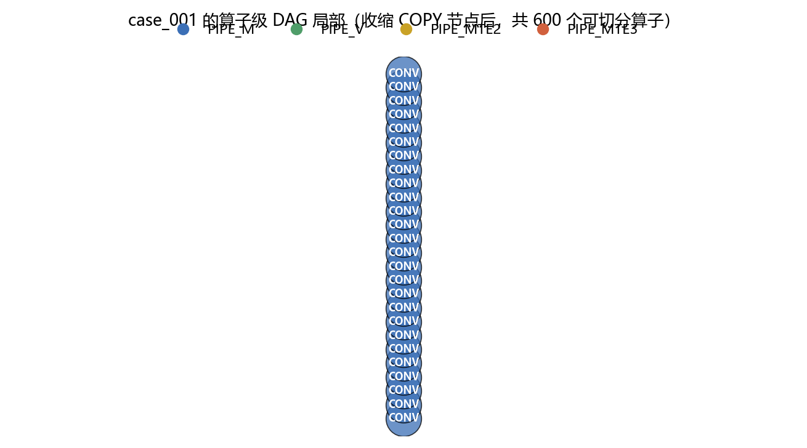

### 2.3 测试数据的结构特征

对 100 个官方用例做特征提取（`solution/npu/features.py`，结果见 `results/features.json`），关键统计如下（min / 中位数 / max）：

| 特征 | 含义 | min | 中位数 | max |
|---|---|---|---|---|
| $\lvert V_{\mathrm{op}}\rvert$ | 可切分算子数 | 552 | 3 720 | 35 705 |
| $D$ | DAG 深度 | 3 | 47.5 | 2 440 |
| $\bar W$ | 平均宽度 $=\lvert V_{\mathrm{op}}\rvert/D$ | 4.68 | 44.3 | 3 110 |
| $K$ | 弱连通分量数 | 1 | 39.5 | 2 666 |
| $\rho_{\max}$ | 最大分量算子占比 | 0.0004 | 0.122 | 1.000 |
| $\mathrm{CP}/\sum c_v$ | 关键路径占总计算量比 | 0.00016 | 0.023 | 0.293 |
| $\max(M,V)\cdot \mathrm{bw}/B_{\mathrm{DDR}}$ | 计算量 / DDR 时间下界 | 3.85 | 19.9 | 1 177 |
| $\sum_{\mathrm{UB}} s_t / C_{\mathrm{UB}}$ | UB 压力 | 0 | 14.6 | 2 745 |

由此得到三条判断，直接指导算法设计：

1. **并行潜力普遍充足**：关键路径中位数只占总计算量的 2.3%，且一半以上的用例有 40 个以上互不连通的分量。因此**"先按连通结构分核、再谈通信"**是正确的第一性策略。
2. **绝大多数用例是计算受限而非带宽受限**：计算量/DDR 时间下界的中位数接近 20，说明适度增加重复读取以换取并行度是划算的；但仍有用例低至 3.85，必须在目标中保留 DDR 项。
3. **整图单 Task 本身受容量之苦**：UB 压力中位数达 14.6 倍容量；官方单核基准在 40/100 个用例上产生了换入换出（最大 $2.77\times10^8$ 字节）。这意味着**多核切分可以通过缩小 Task 规模顺带消除换入换出，从而出现超线性加速**。

有 16 个用例只有一个连通分量、29 个用例最大分量占比超过 50%，它们是难例，需要真正的 DAG 划分而非分量装箱。

### 2.4 三个问题的差异与统一

| | 问题 1（场景 A） | 问题 2（场景 B） | 问题 3（+L2） |
|---|---|---|---|
| Task | 子图 | 核心 | 核心 |
| 同核子图边界 | 必经 DDR，产生搬运 | **零搬运**，只影响顺序 | 同左 |
| 跨核代价 | 1000 cycle + Task 全串行 | 500 cycle + 申请序停摆 | 同左，但重复读取可被 Cache 吸收 |
| 子图粒度倾向 | **粗**（摊薄边界搬运与切换开销） | **中/细**（只为控制执行序与驻留） | 细，且容忍复读 |
| 首要优化量 | 同步层次数（每层 $\times 1000$） | 负载均衡 + 跨核后置 | 负载均衡 + 命中率 |

三者共用同一决策变量与同一可行性构造，差异只体现在**代价系数**与**子图粒度**上。这正是本文用单一框架 CAP-LS 覆盖三问的依据。

---

## 三、模型假设

1. **评估器即真值**。凡模型结论与官方评估器行为冲突，一律以评估器为准；论文中所有上报指标均由官方脚本在 `data/config.txt` 固定配置下给出，不使用自建模拟器的数值。
2. **核内调度算法固定**。Step1/2/3 是给定的黑箱，选手不可更改；模型只把它视为"把子图映射为确定 Pipe 顺序与换入换出的确定性算子"。
3. **同构核心**。$N$ 个核心的计算能力、私有缓存容量完全相同。
4. **DDR 公平共享**。$n$ 个在途搬运时每个获得 $1/n$ 带宽（与多核评估器的 `reschedule_ddr` 一致；不采用 `schedule_step3` 中额外的 $n/(n-1)$ 加入惩罚，因为最终成绩由多核评估器给出）。
5. **Pipe 独占**。每核每条 Pipe 同时只有一条在飞指令（`PIPE_SLOTS = 1`），四条 Pipe 之间可并行。
6. **只读 L2**。仅 `COPY_IN` 可命中；键为写入片上张量的逻辑 id；FIFO 淘汰；命中不刷新顺序；单张量大于容量则不缓存；L2 与 DDR 带宽池相互独立。
7. **搬运时间**。COPY 时长 $=\lceil s/\mathrm{bw}_{\text{eff}}\rceil$，其中 $\mathrm{bw}_{\text{eff}}$ 为命中时的 250 B/cycle 或未命中时的 60 B/cycle（再经带宽池公平共享重算）。
8. **求解时间可接受**。单用例单候选的求解时间应远小于评估时间，算法不得使用对切图×分核×排序的穷举。

---

## 四、符号说明

| 符号 | 含义 |
|---|---|
| $G=(V,E)$ | 原始计算图，$V=T\cup O$ |
| $T,\ O$ | 张量节点集、操作节点集 |
| $V_{\mathrm{op}}=O\setminus O_{\mathrm{copy}}$ | 可切分算子集（非 `COPY_IN`/`COPY_OUT`） |
| $E_{\mathrm{op}}$ | 收缩 COPY 后的算子级依赖边集 |
| $s_t$ | 张量 $t$ 的字节数 |
| $c_v,\ p_v$ | 算子 $v$ 的周期数、所属 Pipe |
| $P_t,\ C_t$ | 张量 $t$ 的可切分生产者集、消费者集 |
| $T_{\mathrm{out}}$ | 被原始 `COPY_OUT` 消费的张量集（图输出） |
| $N$ | 核心数 |
| $x_v\in\{1,\dots,S\}$ | 决策：算子 $v$ 的子图 id |
| $y_s\in\{0,\dots,N-1\}$ | 决策：子图 $s$ 的核心 |
| $\pi_k$ | 决策：核 $k$ 上的子图执行顺序 |
| $c(v)=y_{x_v}$ | 算子 $v$ 所在核心 |
| $r(v)$ | 跨核同步层次 |
| $\sigma$ | 算子级 DAG 的一个线性扩展 |
| $b(v)$ | 算子 $v$ 所属的块（$\sigma$ 的连续区间） |
| $C_{\mathrm{L1}},C_{\mathrm{UB}}$ | 片上容量（524288 / 131072 字节） |
| $\mathrm{bw}$ | DDR 总带宽（60 B/cycle） |
| $\mathrm{bw}_{\mathrm{L2}},\ C_{\mathrm{L2}}$ | L2 带宽 250 B/cycle、容量 1 MB |
| $W_{\text{same}},W_{\text{cross}}$ | 场景 A 的同核切换 100、跨核等待 1000 cycle |
| $\delta$ | 场景 B 的跨核 COPY 同步延迟 500 cycle |
| $L_{k,p}$ | 核 $k$ 上 Pipe $p$ 的总占用周期 |
| $B_{\mathrm{DDR}}$ | 方案的 DDR 搬运总字节 |
| $\mathrm{MK}$ | Makespan |
| $\mathrm{SU}_k=\mathrm{MK}_1/\mathrm{MK}_k$ | $k$ 核加速比 |

---

## 五、统一数学模型

### 5.1 算子级 DAG

把二部图收缩成算子级依赖：

$$E_{\mathrm{op}}=\bigl\{(u,v)\in V_{\mathrm{op}}^2 \;\big|\; \exists\ u\rightsquigarrow v\ \text{在}\ G\ \text{中且中间节点全为 COPY}\bigr\}.$$

这与评估器 `_contract_excluded_copy_nodes` 的定义完全一致。**注意**：形如 $u\to \texttt{COPY\_OUT}\to t_{\mathrm{DDR}}\to \texttt{COPY\_IN}\to v$ 的依赖在"张量生产者/消费者"关系上是断开的，但在 $E_{\mathrm{op}}$ 中仍是一条边；忽略它会导致自查无环而评估器报环。

### 5.2 决策变量

$$x:V_{\mathrm{op}}\to\{1,\dots,S\},\qquad y:\{1,\dots,S\}\to\{0,\dots,N-1\},\qquad \pi_k\ (k=0,\dots,N-1),$$

其中 $S$ 由算法自行决定（题目不限制子图数量），$\pi_k$ 是分配到核 $k$ 的子图的一个全序。

### 5.3 约束

**(C1) 覆盖与唯一性**：$x$ 是 $V_{\mathrm{op}}$ 上的一个划分；每个子图恰出现在一个 $\pi_k$ 中一次。

**(C2) 子图商图无环**：令 $\mathcal G_S=(\{1..S\},E_S)$，$E_S=\{(x_u,x_v)\mid (u,v)\in E_{\mathrm{op}},x_u\neq x_v\}$，要求 $\mathcal G_S$ 无环。

**(C3) 同核顺序相容**：$\forall (s,s')\in E_S$，若 $y_s=y_{s'}=k$ 则 $s$ 在 $\pi_k$ 中先于 $s'$。

**(C4) 场景 A 的 Task 图无环**：$E_S\cup\{(\pi_k[i],\pi_k[i+1])\}$ 无环。

**(C5) 场景 B 的全局执行图无环**：本地数据/内存依赖 $\cup$ Pipe FIFO $\cup$ 跨核 COPY 边无环。

**(C6) 核内容量可行**：对每个 Task，Step2 在任意时刻能找到换出牺牲者，且 Step3 的虚拟额度不耗尽；等价地要求任一时刻
$$\sum_{t\ \text{驻留}} s_t\;\le\; C_{\mathrm{pos}},\qquad \mathrm{pos}\in\{\mathrm{L1},\mathrm{UB}\}.$$

**(C7) Pipe 资源**：每核每 Pipe 同时至多 1 条在飞指令，且发射顺序等于 Step3 给出的固定序。

**(C8) 共享 DDR 带宽**：任意时刻在途 DDR 搬运的瞬时带宽之和不超过 $\mathrm{bw}$，按公平共享分配。

**(C9) L2 语义**（问题 3）：只读、FIFO、容量 $C_{\mathrm{L2}}$、命中带宽 $\mathrm{bw}_{\mathrm{L2}}$、与 DDR 池独立。

### 5.4 目标函数

题目以 Makespan 为主指标、额外搬运量为次指标。本文的**上报目标**严格为

$$\min\ \mathrm{MK}(x,y,\pi)\quad\text{（由官方评估器计算）},$$

并在同 Makespan 时以额外搬运量 $\Delta B$ 作次序。搜索内部使用可微分解析代理

$$F(x,y,\pi)=\max\Bigl(\underbrace{\max_{k}\max_{p} L_{k,p}}_{\text{每核流水线瓶颈}},\ \underbrace{\frac{B_{\mathrm{DDR}}}{\mathrm{bw}}}_{\text{全局带宽下界}}\Bigr)\;+\;\lambda\cdot R(y),$$

其中 $R(y)=\max_v r(v)$ 是跨核同步深度，$\lambda$ 取 $W_{\text{cross}}=1000$（问题 1）或 $\delta=500$（问题 2/3）。三项分别对应 Makespan 的三条下界来源，且都可在 $O(|T_b|+m)$ 内增量更新。

**下界**。任何可行解满足
$$\mathrm{MK}\ \ge\ \max\Bigl(\frac{\sum_{v:p_v=\mathrm{M}}c_v}{N},\ \frac{\sum_{v:p_v=\mathrm{V}}c_v}{N},\ \frac{B_{\mathrm{DDR}}^{\min}}{\mathrm{bw}},\ \mathrm{CP}\Bigr),$$
其中 $B_{\mathrm{DDR}}^{\min}$ 为原图自带搬运量，$\mathrm{CP}$ 为算子级关键路径。四条下界分别来自 Cube 单元、Vector 单元、共享 DDR 带宽与依赖链，互相独立，故取最大。第十章用 $\mathrm{MK}/\mathrm{LB}$ 度量解与不可达下界的距离。

**关于超线性加速**。注意上述下界只约束 $\mathrm{MK}_k$，并不约束分母 $\mathrm{MK}_1$。单核基准把整图作为一个 Task，其 L1/UB 驻留量远超容量（§2.3：UB 压力中位数 14.6 倍），Step2 因此插入大量换入换出；而多核切分把 Task 规模缩小到容量量级，这部分搬运可以**整体消失**。于是

$$\mathrm{SU}_k=\frac{\mathrm{MK}_1}{\mathrm{MK}_k}=\underbrace{\frac{\text{并行度收益}}{\vphantom{X}}}_{\le\,k}\times\underbrace{\frac{\text{单核换入换出开销}}{\text{多核换入换出开销}}}_{\text{可}>1}$$

允许出现 $\mathrm{SU}_k>k$ 的超线性加速。这不是测量误差，而是"切分同时改变了分子的调度质量"这一事实的直接后果；实验中确实观测到了这一现象（§10.3）。

### 5.5 可行性的构造性刻画（本文核心引理）

直接对 (C2)–(C5) 做组合搜索代价极高。本文给出一个**构造**，使这些约束自动成立。

> **定义（跨核同步层次）**。给定核心分配 $c:V_{\mathrm{op}}\to\{0..N-1\}$，令
> $$r(v)=\begin{cases}0,& \mathrm{pred}(v)=\varnothing,\\[2pt] \displaystyle\max_{u\to v}\bigl(r(u)+\mathbb 1[c(u)\neq c(v)]\bigr),&\text{否则}.\end{cases}$$

> **引理 1**。取子图为等价类 $S_{(k,\rho)}=\{v\mid c(v)=k,\ r(v)=\rho\}$，并按字典序 $(\rho,k)$ 递增编号、每核的 $\pi_k$ 取其子图按编号升序，则 (C1)–(C5) 全部成立。
>
> *证明*。对任意边 $(u,v)\in E_{\mathrm{op}}$：若 $c(u)=c(v)$ 则 $r(v)\ge r(u)$，两者或同属一个等价类、或 $v$ 的编号更大；若 $c(u)\neq c(v)$ 则 $r(v)\ge r(u)+1$，$v$ 的编号严格更大。故 $E_S$ 的每条边都指向更大编号，$\mathcal G_S$ 无环，(C2) 成立；同核情形给出 (C3)；(C4) 中新增的同核链边亦沿编号递增，故无环；(C5) 同理，跨核 COPY 边由 $\rho$ 严格递增保证无回边。$\square$

> **引理 2（同层独立性）**。同一层次 $\rho$ 内不存在跨核边。
>
> *证明*。若 $(u,v)$ 跨核且 $r(u)=r(v)=\rho$，则由定义 $r(v)\ge r(u)+1=\rho+1$，矛盾。$\square$

引理 2 的调度含义是：**第 $\rho$ 层的各核子图完全独立，可以无同步地并行**；跨核同步只发生在层与层之间，总共发生 $R=\max_v r(v)$ 次。因此
$$\mathrm{MK}^{\text{A}}\;\lesssim\;\sum_{\rho=0}^{R}\max_{k}\,\mathrm{dur}(S_{(k,\rho)})\;+\;W_{\text{cross}}\cdot R+W_{\text{same}}\cdot\bigl(\textstyle\sum_k(\#\text{层}_k)-N\bigr),$$
这正是问题 1 的 Task 级时序模型；$R$ 因而成为问题 1 的一级优化量。

图 3 用一个 8 节点的小例子说明整个构造：(a) 原始算子级 DAG；
(b) 亲和原子化后按 $\sigma$ 的连续区间成块，商图必为 DAG；
(c) 分核后按跨核同步层次 $r$ 分层，$r$ 更大的算子被推迟执行。

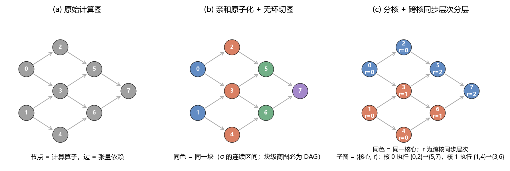

引理 1 还有一个副产品：**依赖远端数据的算子被自动推迟到更高层次**。结合 2.2 节事实 3，这恰好消除了"跨核 `COPY_IN` 排在核内序列前部导致整核停摆"的病态——核心会先跑完本层全部本地就绪工作，再去等远端数据。§11.1 的消融实验显示，这一条是全部机制中贡献最大的。

---

## 六、问题一：场景 A 的切图与调度

### 6.1 场景 A 的 Task 级时序模型

场景 A 中一个子图即一个 Task，同核 Task 严格串行，且 Task 激活要求**全部**前驱 Task 完成：

$$
\mathrm{start}(s)=\max\Bigl(\mathrm{prevEnd}(y_s)+W_{\text{same}},\ \max_{s'\in\mathrm{pred}(s),\,y_{s'}\neq y_s}\bigl(\mathrm{end}(s')+W_{\text{cross}}\bigr),\ \max_{s'\in\mathrm{pred}(s),\,y_{s'}=y_s}\mathrm{end}(s')\Bigr),
$$
$$\mathrm{end}(s)=\mathrm{start}(s)+\mathrm{dur}(s),\qquad \mathrm{MK}^{\mathrm A}=\max_s \mathrm{end}(s).$$

Task 时长用四条 Pipe 的并行上界估计（两类 COPY 共用 DDR 带宽）：

$$\mathrm{dur}(s)\;\approx\;\max\Bigl(M_s,\ V_s,\ \frac{B^{\mathrm{in}}_s+B^{\mathrm{out}}_s}{\mathrm{bw}}\Bigr),$$

其中 $M_s=\sum_{v\in s,p_v=\mathrm M}c_v$，$V_s$ 同理，边界字节按评估器规则计算：

$$B^{\mathrm{in}}_s=\!\!\sum_{t:\,C_t\cap s\neq\varnothing,\ P_t\cap s=\varnothing}\!\! s_t,\qquad
B^{\mathrm{out}}_s=\!\!\sum_{\substack{t:\,P_t\cap s\neq\varnothing\\ t\in T_{\mathrm{out}}\ \vee\ C_t=\varnothing\ \vee\ C_t\setminus s\neq\varnothing}}\!\! s_t .$$

### 6.2 三难权衡的定量刻画

设把某核的算子集合切成 $q$ 个子图，则该核的完成时间近似为

$$T_k(q)\;\approx\;\underbrace{\max(M_k,V_k)}_{\text{计算，与 }q\text{ 无关}}\;+\;\underbrace{(q-1)W_{\text{same}}}_{\text{切换}}\;+\;\underbrace{\frac{\Delta B(q)}{\mathrm{bw}}}_{\text{新增边界搬运}}\;-\;\underbrace{\Phi(q)}_{\text{换入换出的减少}},$$

其中 $\Delta B(q)$ 随 $q$ 单调不减（切得越碎，跨子图数据越多要经 DDR），而 $\Phi(q)$ 也随 $q$ 单调不减（子图越小，Step2 越不会溢出）。因此存在最优粒度 $q^\*$：**$q$ 太小则换入换出爆炸，太大则边界搬运与切换开销爆炸**。这与题目"算法优化方向"中描述的"合并后负时间收益"现象一致。本文不对 $q^\*$ 做解析求解，而是在 S4 用参数网格覆盖 $q$ 的量级并由官方评估器择优（见 6.3）。

### 6.3 CAP-LS 算法（问题 1 版本）

**S1 亲和原子化与无环分块**

以张量扇出区分两类连接：

$$\text{强连接：}|C_t|\le\theta\ \Rightarrow\ \text{把 } P_t\cup C_t \text{ 并入同一原子};\qquad \text{广播：}|C_t|>\theta\ \Rightarrow\ \text{允许复读，不绑定}.$$

$\theta$ 从大到小在 $\{\infty,16,8,4,2,1\}$ 中取第一个使"最大原子计算量 $\le \beta\,W/N$"的值（$W=\sum_v c_v$，$\beta$ 为粒度参数）。收缩后的原子图可能成环，用 Tarjan 求 SCC 并合并，保证原子图为 DAG。随后按原子拓扑序拼接，原子内部用**逆向 DFS 序**（与官方 Step1 同族，使连续区间近似一个祖先锥），得到全局线性扩展 $\sigma$；计算量仍超上限的原子沿 $\sigma$ 再切成连续块。**块 = $\sigma$ 的连续区间**，因此块级商图必为 DAG。

**S2 负载/通信/同步深度联合分配**

以 LPT（最大优先）把块装入核心，代价为

$$\Delta(k)=\max\bigl(L^{\mathrm M}_k+M_b,\ L^{\mathrm V}_k+V_b\bigr)+w_{\mathrm{comm}}\!\!\sum_{j:\,c_j\neq k}\!\!\mathrm{bytes}(b,j),$$

再做移动式局部搜索：每次把一个块换到另一核，若 $F$ 下降则接受。为控制规模，只考察计算量最大的 260 个块、移动次数上限 2200。单次移动只需重算该块触及张量的搬运贡献，复杂度 $O(|T_b|+m)$。

**S3 同步层次分层**

由块分配得到 $c(v)$，按 §5.5 计算 $r(v)$，取子图 $=(c,r)$ 等价类；必要时按算子数上限沿 $\sigma$ 再切片（对应 6.2 的 $q$）。

图 4 给出三个问题共用的求解框架及其场景自适应之处。

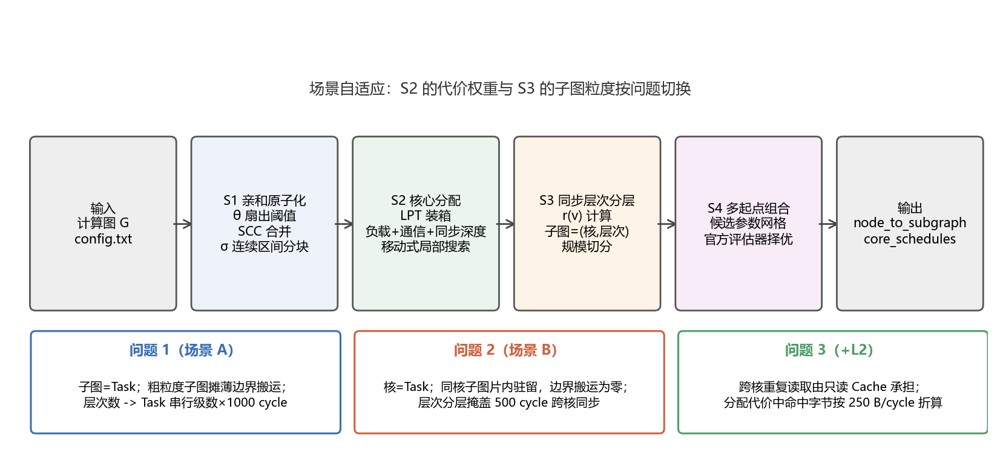

**S4 多起点组合**

对粒度 $\beta\in\{0.005,0.08,0.15,0.35,0.6\}$、初始解 $\in\{\text{LPT},\ \text{轮转},\ \text{连续段}\}$、子图模式 $\in\{\text{层次},\ \text{块}\}$、启用核数 $\in\{N,\,N-1,\,\lfloor N/2\rfloor\}$ 组成 12 个候选，全部交**官方评估器**打分取最优。其中"连续段"起点把 $\sigma$ 切成 $N$ 段连续区间，专门服务于"块图近似链状"的体同步/归约结构——它把跨核同步层次数从 $O(m)$ 降到 $O(N)$。由于候选之间常产生相同方案，配合方案哈希缓存，实际调用评估器的次数远少于候选数；对 $|V_{\mathrm{op}}|>1.2\times10^4$ 的大图自动收缩到 4 个候选，保证单用例求解时间可控。

算法整体如下。

> **算法 1　CAP-LS（三个问题共用）**
>
> **输入**：计算图 $G$，核数 $N$，场景 $P\in\{1,2,3\}$，粒度 $\beta$
> **输出**：`node_to_subgraph`，`core_schedules`
>
> 1. $E_{\mathrm{op}}\leftarrow$ 收缩 COPY 后的算子依赖；
> 2. **for** $\theta\in(\infty,16,8,4,2,1)$：做亲和原子化；**若** 最大原子计算量 $\le\beta W/N$ **则 break**；
> 3. 对原子图求 SCC 并合并，得到原子 DAG；按拓扑序拼接各原子的逆向 DFS 序，得到线性扩展 $\sigma$；
> 4. 计算量仍超限的原子沿 $\sigma$ 切块，得到块集合 $\{b_1,\dots,b_m\}$（均为 $\sigma$ 的连续区间）；
> 5. 初始分配 $c^{(0)}\leftarrow$ LPT / 轮转 / 连续段；
> 6. **重复**：取计算量最大的 260 个块，尝试移到另一核，若 $F$ 下降则接受；**直到** 无改进或达 2200 次移动；
> 7. $r(v)\leftarrow$ 跨核同步层次；子图 $\leftarrow (c(v),r(v))$ 等价类（必要时按规模沿 $\sigma$ 切片）；
> 8. 按 $(r,c)$ 递增编号，每核的 $\pi_k$ 取其子图编号升序；
> 9. 对 12 组候选参数重复步骤 2–8，用官方评估器取 Makespan 最小者。

其中步骤 2–4 是 S1，5–6 是 S2，7–8 是 S3，9 是 S4；场景差异只体现在三处：步骤 6 的 $\lambda$（问题 1 取 $W_{\text{cross}}=1000$，问题 2/3 取 $\delta=500$）、步骤 6 是否折算 L2 命中（仅问题 3）、以及步骤 7 的切片粒度。

### 6.4 为什么粗粒度对问题 1 更有利

由 §6.1，同核 Task 之间**没有任何流水线重叠**（`core_active_task` 保证同一时刻每核至多一个活跃 Task）。因此把 $q$ 个独立子图合成一个 Task 能带来两重收益：头部 `COPY_IN` 与尾部 `COPY_OUT` 被计算掩盖；子图之间的数据不再经 DDR 往返。这解释了实验中问题 1 的最优解通常落在"每核每层一个子图"（即引理 1 的原始形态、不再切片）上。

---

## 七、问题二：场景 B 的切图与调度

### 7.1 模型差异

场景 B 中每核合并为一个 Task，于是

* **同核子图边界搬运恒为 0**（事实 1），切图在核内退化为纯粹的**排序**决策；
* 跨核依赖由 `cross_links` 表达，目标 `COPY_IN` 最早释放时刻为 $\mathrm{end}(\texttt{COPY\_OUT})+\delta$；
* 真实代价由事实 3 决定：跨核接收点若排在核内序列前部，整核停摆。

核 $k$ 的完成时间下界为四条 Pipe 的最大占用：

$$T_k=\max\Bigl(M_k,\ V_k,\ \frac{B^{\mathrm{in}}_k}{\mathrm{bw}},\ \frac{B^{\mathrm{out}}_k}{\mathrm{bw}}\Bigr),\qquad
\mathrm{MK}^{\mathrm B}\ \gtrsim\ \max\Bigl(\max_k T_k,\ \frac{B_{\mathrm{DDR}}}{\mathrm{bw}}\Bigr)+\delta\cdot R .$$

其中按评估器规则

$$B^{\mathrm{in}}_k=\!\!\sum_{t:\,P_t=\varnothing,\ k\in \mathcal C_t}\!\! s_t\;+\;\!\!\sum_{t}\ \sum_{\substack{\kappa\in\mathcal P_t,\ k\in\mathcal C_t\\ \kappa\neq k}}\!\! s_t,\qquad
B^{\mathrm{out}}_k=\!\!\sum_{\substack{t\in T_{\mathrm{out}}\ \vee\ C_t=\varnothing\\ k\in\mathcal P_t}}\!\! s_t\;+\;\!\!\sum_{t}\ \sum_{\substack{\kappa\in\mathcal C_t,\ k\in\mathcal P_t\\ \kappa\neq k}}\!\! s_t,$$

$\mathcal P_t=\{c(u):u\in P_t\}$、$\mathcal C_t=\{c(u):u\in C_t\}$ 为触及该张量的生产核集合与消费核集合。

### 7.2 算法调整（P2-A … P2-E）

相对问题 1，CAP-LS 在场景 B 下做五处调整：

* **P2-A 核内重排**：子图名次即核内算子序；层次分层把"需要远端数据的算子"整体后移，直接针对事实 3。
* **P2-B 强通信同核合并**：$\theta$ 亲和原子保证强连接算子同核；同核后其通信代价归零（而问题 1 仍需经 DDR）。
* **P2-C 缓存压力估计**：子图粒度上限用算子数 $\times$ 平均张量大小近似峰值驻留，避免单核 Task 过大触发 Step2 换入换出。
* **P2-D 局部拆分/合并**：$\beta$ 网格同时覆盖"粗到每核一个子图"与"细到千级子图"两端。
* **P2-E 联合优化**：S2 的代价 $F$ 同时含负载、通信与同步深度三项，等价于在切图—分核—排序三者上联合下降。

### 7.3 粒度—驻留—通信—效率的耦合

场景 B 中把更多子图放在同一核可减少跨核搬运，但跨越多个子图的驻留数据会持续占用 L1/UB，压缩中间子图的可用空间。本文用**块计算量上限 $\beta W/N$** 同时控制这两端：$\beta$ 小 ⇒ 子图多 ⇒ 驻留窗口短、换入换出少，但跨核边多；$\beta$ 大 ⇒ 反之。§11.2 的粒度敏感性实验给出了 $\beta$ 的经验最优区间。

---

## 八、问题三：共享只读 L2 下的切图与调度

### 8.1 Cache 收益的结构来源

由《评估器机制说明》O 节，命中键是**写入片上张量的逻辑 id**。因此命中只可能来自两类结构：

1. **跨核多播**：张量 $t$ 被 $|\mathcal C_t|$ 个核心读入，第一次未命中并写入 Cache，其余 $|\mathcal C_t|-1$ 次命中；
2. **换入复读**：Step2 把同一逻辑张量多次换入，第二次起命中。

定义张量 $t$ 的**复用度**与**Cache 价值**：

$$\mathrm{reuse}(t)=\#\{\text{对 }t\text{ 产生的 COPY\_IN}\},\qquad
\mathrm{value}(t)=s_t\cdot\bigl(\mathrm{reuse}(t)-1\bigr)\cdot\mathbb 1[s_t\le C_{\mathrm{L2}}],$$

则**期望节省的 DDR 字节**为 $\sum_t \mathrm{value}(t)$，对应节省时间

$$\Delta T_{\mathrm{L2}}\;\approx\;\sum_t \mathrm{value}(t)\Bigl(\frac{1}{\mathrm{bw}}-\frac{1}{\mathrm{bw}_{\mathrm{L2}}}\Bigr)\;=\;\sum_t \mathrm{value}(t)\cdot\frac{1}{60}\Bigl(1-\frac{60}{250}\Bigr)\;=\;0.0127\sum_t \mathrm{value}(t).$$

同时命中访问**不进 DDR 池**，等价于把 DDR 争用降低同样的字节数——这是 L2 的第二重收益，在带宽受限的用例上更显著。

### 8.2 Cache 感知的分配代价

把命中折算进 S2 的代价函数：核 $k$ 的 `PIPE_MTE2` 占用由

$$\frac{B^{\mathrm{in}}_k}{\mathrm{bw}}\quad\longrightarrow\quad \frac{B^{\mathrm{in}}_k-H_k}{\mathrm{bw}}+\frac{H_k}{\mathrm{bw}_{\mathrm{L2}}},$$

全局 DDR 下界由 $B_{\mathrm{DDR}}/\mathrm{bw}$ 变为 $(B_{\mathrm{DDR}}-\sum_k H_k)/\mathrm{bw}$，其中 $H_k$ 为核 $k$ 的预测命中字节（按"同一张量的第 2 次及以后读入命中"计算，并剔除超过 $C_{\mathrm{L2}}$ 的张量）。

**由此产生的定性变化**：在问题 2 中，把一个被多核读取的张量复制到多个核是纯粹的损失（每份都吃 DDR 带宽）；在问题 3 中，第 2 份起只花 $1/250$ 的时间且不占 DDR。于是 **L2 把"重复读取"从硬性代价变成近似免费的操作，从而允许更激进的并行切分**。算法层面体现为：$\theta$ 可以取得更小（更多张量被视为广播），块可以切得更细，负载均衡的自由度更大。

### 8.3 不能假设"Cache 越多越好"

Cache 收益强烈依赖 DAG 的输入共享结构：

* 若用例由大量互不连通的分量构成，最优切图本就不产生跨核复读，$\sum_t\mathrm{value}(t)\approx0$，L2 收益趋近于零；
* 若用例是"广播型"结构（少量高扇出张量供给大量算子），复用度高，L2 收益显著；
* 若用例受计算而非带宽约束（计算量/DDR 时间下界很大），即使命中率高，Makespan 也几乎不变。

因此 §10.5 对 L2 收益做了**按用例结构分层的统计**，而非只报一个平均值；
上述四个量（复用度、Cache 价值、期望节省、Cache 压力）由 `npu/cachemodel.py`
计算，并提供一个按 FIFO 语义复演的更紧命中估计，用于与官方实测命中率对照。

---

## 九、复杂度分析

设 $n=|V_{\mathrm{op}}|$、$e=|E_{\mathrm{op}}|$、$m$ 为块数、$N$ 为核数、$\tau$ 为张量数。

| 阶段 | 复杂度 | 说明 |
|---|---|---|
| 图解析与 COPY 收缩 | $O(n+e+\tau)$ | 一次性，结果缓存 |
| 特征提取 | $O(n+e+\tau)$ | 缓存到 `results/cache/features` |
| S1 亲和原子化 | $O\bigl((n+\tau)\,\alpha(n)\bigr)$ | 并查集 |
| S1 SCC 合并 | $O(m_0+e_0)$ | 迭代 Tarjan |
| S1 局部性序 $\sigma$ | $O(n+e)$ | 迭代逆向 DFS |
| S2 LPT 装箱 | $O(m\log m+mN)$ | |
| S2 局部搜索 | $O\bigl(B\,(\bar T+m)\bigr)$ | $B\le2200$ 次移动，$\bar T$ 为块平均触及张量数 |
| S3 层次分层 | $O(n+e)$ | 一次拓扑扫描 |
| S4 多起点 | $\times 12$ 候选（大图自动降为 4） | 候选间方案哈希去重 |
| **合计（单候选）** | $O(n+e+\tau+B(\bar T+m))$ | 近似线性 |

关键在于**全程没有对 "切图 $\times$ 分核 $\times$ 排序" 的枚举**：切图由 $\sigma$ 连续区间构造，排序由引理 1 直接给出，只有分核进入搜索，且搜索是增量的。作为对照，朴素枚举的规模是

$$\underbrace{B_n}_{\text{切图（Bell 数）}}\times\underbrace{N^{S}}_{\text{分核}}\times\underbrace{\prod_k |\pi_k|!}_{\text{同核排序}},$$

在 $n=552$（最小用例）时已远超宇宙原子数；本文把它压到单候选近线性。

---

## 十、实验设计与结果

### 10.1 实验设置

**数据**：题目给定的全部 100 个正式测试计算图 `data/case_001.json … case_100.json`，
规模跨度 $|V_{\mathrm{op}}|\in[552,\,35\,705]$，**无任何筛选或子采样**。

**配置**：`data/config.txt` 原值，不做任何修改（L1 = 524 288 B，UB = 131 072 B，
DDR 带宽 = 60 B/cycle，场景 A 的跨核/同核等待 = 1000/100 cycle，
场景 B 的跨核同步延迟 = 500 cycle，只读 L2 = 1 048 576 B / 250 B·cycle$^{-1}$）。

**评估**：全部指标由官方脚本 `multicore_cut_evaluate_problem_{1,2,3}.py` 给出。
本项目通过 `npu.evaluate.evaluate_plan` 直接调用官方评估函数，与命令行入口等价：
在 case_019、问题 2、$N=4$ 上，求解器内部报告 Makespan = 27 333，
官方 CLI `python code/multicore_cut_evaluate_problem_2.py …` 报告 27 333，逐位一致。

**核数**：$N=1,2,3,4,5$。$N=1$ 按题目定义取"核内调度算法在整图上计算"的单核基准，
加速比恒为 1。我们另外验证了：把"整图一个子图放 0 号核"的方案交给问题 1 评估器，
100 个用例的 Makespan 与官方 `singlecore_evaluate.py` **完全相同**（0 处不一致），
说明加速比分母口径与官方一致。

**统计口径**：加速比是比值型指标，跨用例聚合一律用**几何平均**，
同时报告中位数、最小值与最大值。搬运量报告总和与中位数。

**运行环境**：Windows 11，32 逻辑核，Python 3.13，16 个工作进程并行；
算法本身单线程，报告的求解时间为单线程时间。

**基线**：
* **B1 随机**：官方 `stub_multicore_cut_and_schedule.generate_multicore_plan`
  （随机拓扑区间 + 随机分核），题目明确说明它不是性能基线，此处作为可行性下界；
* **B2 拓扑等分**：算子级 DAG 线性扩展等分为 $4N$ 段 + 轮转分核（无通信、无负载、无分层）；
* **B3 负载均衡**：同 B2 分块 + LPT 计算量装箱（无通信感知、无分层）；
* **B4 通信聚类**：亲和原子化分块 + 轮转分核（无负载均衡、无分层）；
* **B5 单核参考**：整图一个子图放 0 号核。

全部实验共调用官方评估器 10,780 次（方案哈希去重后）。

### 10.2 主结果：平均加速比曲线

图 5 给出三个问题在 $N=1\ldots5$ 下的平均加速比（100 个用例的几何平均），
图 5b 给出逐用例分布。

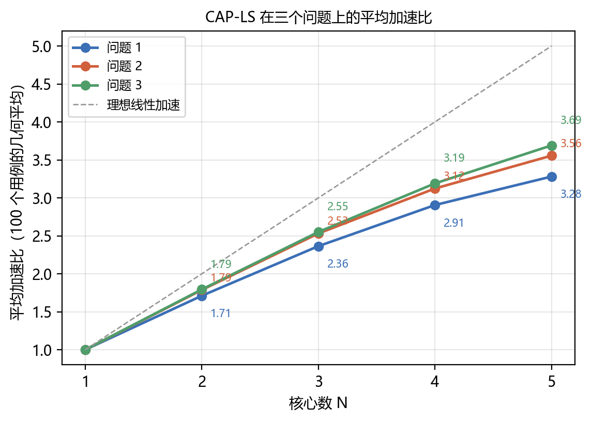

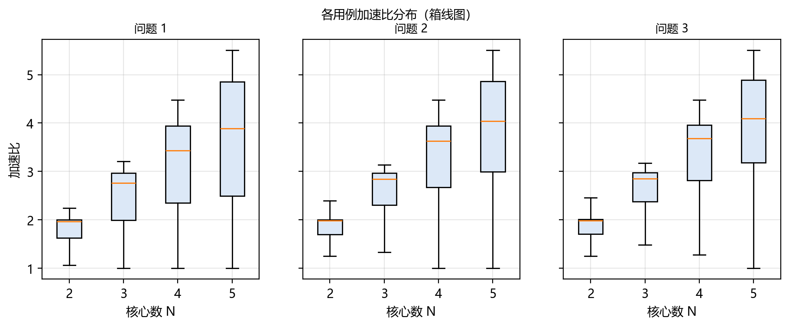

**表 10-1　平均加速比（几何平均 / 中位数 / 最小 / 最大，100 个用例）**

| 问题 | $N=2$ | $N=3$ | $N=4$ | $N=5$ | $N=4$ 中位数 | $N=4$ 最小 | $N=4$ 最大 |
|---|---|---|---|---|---|---|---|
| 问题 1（场景 A） | 1.71 | 2.36 | 2.91 | 3.28 | 3.43 | 1.00 | 4.48 |
| 问题 2（场景 B） | 1.79 | 2.53 | 3.12 | 3.56 | 3.63 | 1.00 | 4.48 |
| 问题 3（+L2） | 1.79 | 2.55 | 3.19 | 3.69 | 3.68 | 1.00 | 4.48 |

三条观察：

1. **加速比随核数单调上升，且三个场景的排序稳定为 问题 3 > 问题 2 > 问题 1**。
   $N=4$ 时三者的几何平均分别为 2.91 / 3.12 / 3.19，
   并行效率 $\mathrm{SU}/N$ 为 73% / 78% / 80%；中位数则达到
   3.43 / 3.63 / 3.68（效率 86% / 91% / 92%）。
   几何平均明显低于中位数，说明**少数结构受限的难例把均值拉低**（见 §10.3）。
2. **问题 1 与问题 2 的差距正是场景差异的定量体现**。场景 A 要求所有跨子图数据经
   DDR 中转、且同核 Task 完全串行，$N=4$ 时代价约为 7 个百分点的并行效率
   （2.91 → 3.12）；$N=5$ 时扩大到 3.28 → 3.56。
   核数越多，跨核 Task 依赖越多，场景 A 的 1000 cycle 等待与边界搬运越吃亏。
3. **出现了超线性加速**。$N=4$ 时问题 2 有 9 个用例的加速比超过 4（最高 4.48），
   $N=2$ 时更有 30 个用例超过 2。核对这些用例的单核基准可以确认机制：
   它们的单核基准全部产生了大量换入换出（case_059 为 1.69 MB，case_097 为 10.6 MB，
   case_079 为 32.4 MB），而多核切分把 Task 规模压到容量量级后这部分搬运基本消失。
   这与 §5.4 的分解式一致，不是测量噪声。

**额外搬运量**。$N=4$、问题 2 的 100 个用例合计新增 DDR 搬运 $1.385\times10^9$ 字节，
其中**切分边界只占 25.9%，其余 74.1% 来自核内换入换出**。作为参照，官方单核基准
自身的换入换出就有 $1.242\times10^9$ 字节。也就是说，**把任务铺到 4 个核上只让总 DDR
搬运比单核基准多 11.5%，却换来 3 倍以上的加速**——这正是 §2.3 判断"适度增加重复读取
以换取并行度是划算的"的实验证据。另有 8 个用例的额外搬运量为 0（完全按连通分量装箱，
既无跨核通信也无换入换出）。

### 10.3 难例分析

按 §2.3 的结构特征把 100 个用例分为三层，可以清楚看到加速比的来源与上限：

**表 10-2　按最大连通分量占比 $\rho_{\max}$ 分层的加速比（问题 2，$N=4$）**

| 分层 | 用例数 | 几何平均 | 中位数 | 最小值 |
|---|---|---|---|---|
| $\rho_{\max}<0.2$（分量碎片化） | 59 | **3.68** | 3.90 | 2.12 |
| $0.2\le\rho_{\max}<0.5$ | 12 | 3.04 | 3.08 | 2.03 |
| $\rho_{\max}\ge0.5$（单一主分量） | 29 | **2.27** | 2.27 | 1.00 |

与图特征的相关系数（问题 2、$N=4$，$n=100$）进一步确认了这一点：

| 特征 | 与加速比的相关系数 |
|---|---|
| 最大连通分量占比 $\rho_{\max}$ | **−0.68** |
| 关键路径占比 $\mathrm{CP}/\sum c_v$ | **−0.68** |
| DAG 平均宽度（对数） | **+0.68** |
| 计算量 / DDR 时间下界（对数） | −0.01 |
| 算子数（对数） | +0.11 |

**结论是清晰的：加速比由 DAG 的"可并行结构"决定，而不是由规模或带宽比决定。**
带宽比与加速比几乎无关（−0.01），说明在题目给定的 60 B/cycle 下，
绝大多数用例没有触到带宽墙；规模也几乎无关（+0.11），说明算法在 552–35 705 个算子的
跨度上表现稳定。

**最难的几个用例**（问题 2、$N=4$）：case_016（1.00）、case_024（1.27）、case_048（1.29）、
case_051（1.44）、case_064（1.54）、case_069（1.63）。以 case_016 为例，它是
17 995 个算子、深度 2 440 的**体同步链**：305 个阶段串行，每个阶段内只有 12 路并行，
阶段之间被一个归约节点完全收束。其总计算量与关键路径之比只有 11.8，
即**理论并行上界就是 11.8 倍、而且必须把每个阶段横向切开**；一旦横切，
每个阶段都要付一次跨核同步，305 级同步的代价超过了并行收益。
CAP-LS 的多起点组合在这类用例上会**自动选择只用 1 个核**（`cores_used` 候选），
从而保证加速比不低于 1.00——这是"知道什么时候不该并行"的能力，
也是表 10-1 中 $N=4$ 最小值恰为 1.00 的原因。

### 10.4 与基线算法的对比

图 6 给出问题 2、$N=4$ 下五种算法的加速比分布，图 7 给出额外搬运量分布，
图 13 给出"Makespan–搬运量"的 Pareto 视图。

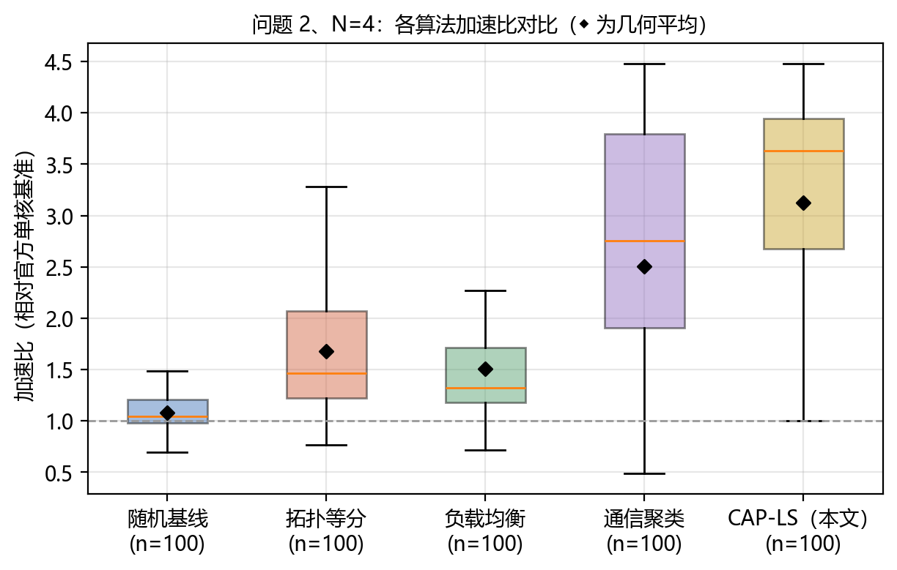

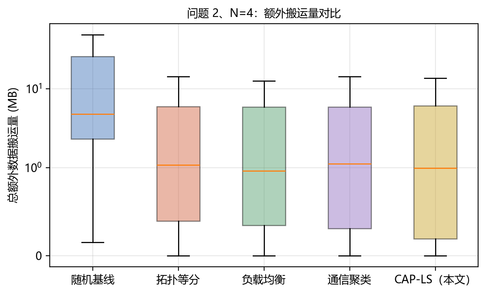

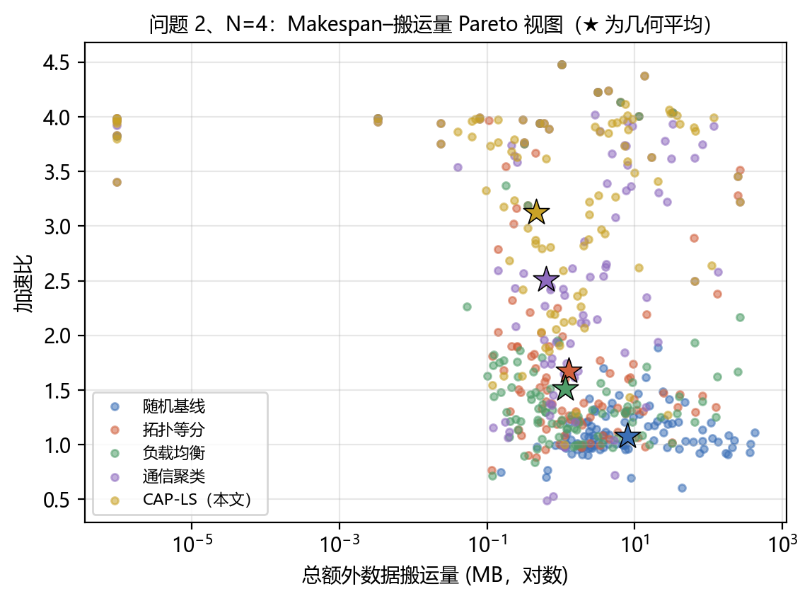

**表 10-2　各算法平均加速比（几何平均，$N=4$）**

| 算法 | 问题 1 | 问题 2 | 问题 3 |
|---|---|---|---|
| B1 随机（官方 stub） | 0.91 | 1.08 | 1.09 |
| B2 拓扑等分 | 1.06 | 1.68 | 1.70 |
| B3 负载均衡 | 1.07 | 1.51 | 1.53 |
| B4 通信聚类 | 2.05 | 2.51 | 2.56 |
| **CAP-LS（本文）** | 2.91 | 3.12 | 3.19 |
| 基线不可行率（最大） | 0.0% | 0.0% | 0.0% |

问题 1 与问题 3 的同类图分别为 `figures/fig06_makespan_compare_p1_n4.png`、
`figures/fig06_makespan_compare_p3_n4.png`（加速比）与
`figures/fig07_addedcopy_p1_n4.png`、`figures/fig07_addedcopy_p3_n4.png`
（搬运量），趋势一致，正文不再重复列出。

四条观察：

1. **随机切图在场景 A 下甚至不如单核**（几何平均 0.91）。这不是随机算法"不够聪明"，
   而是场景 A 的结构性惩罚：随机分核让几乎每条子图依赖都变成跨核依赖，
   每条付 1000 cycle，且每个子图边界都要经 DDR 往返。
   官方文档已声明该 stub 不是性能基线，此处的作用是给出"可行但无优化"的下界。
2. **只做负载均衡几乎没用**（B3 在问题 2 上 1.51，甚至略低于纯轮转的 B2 1.68）。
   原因是 B2/B3 用的是**纯拓扑区间**分块：区间之间天然是链式依赖，
   再怎么均衡负载也无法消除串行。**这条实验直接证明了"通信/依赖结构比负载均衡更重要"**。
3. **通信感知聚类是最强的单一机制**（B4 达到 2.05 / 2.51 / 2.56）。
   它只做了 CAP-LS 的 S1（亲和原子化），就拿到了大部分收益——
   与 §2.3 "先按连通结构分核" 的判断一致。
4. **CAP-LS 相对最强基线 B4 仍有 24%–42% 的提升**，来源是 S2 的负载/同步深度联合优化
   与 S3 的同步层次分层（见 §11.1 的消融）。
   五种算法在 100 个用例 × 3 个问题 × 4 个核数上**均未产生不可行方案**，
   说明 §5.5 的构造性可行性在所有算法变体上都成立。

图 13 的 Pareto 视图补充了搬运量维度：CAP-LS 的星号（几何平均）位于左上方，
即**同时取得更高加速比与更低额外搬运量**——它并不是靠"多搬数据换并行"取胜的。

### 10.5 问题 3：无 L2 与只读 Cache 的对比

图 10 给出两种配置在 $N=1\ldots5$ 的加速比曲线，图 8 给出命中率与 L2 净收益。

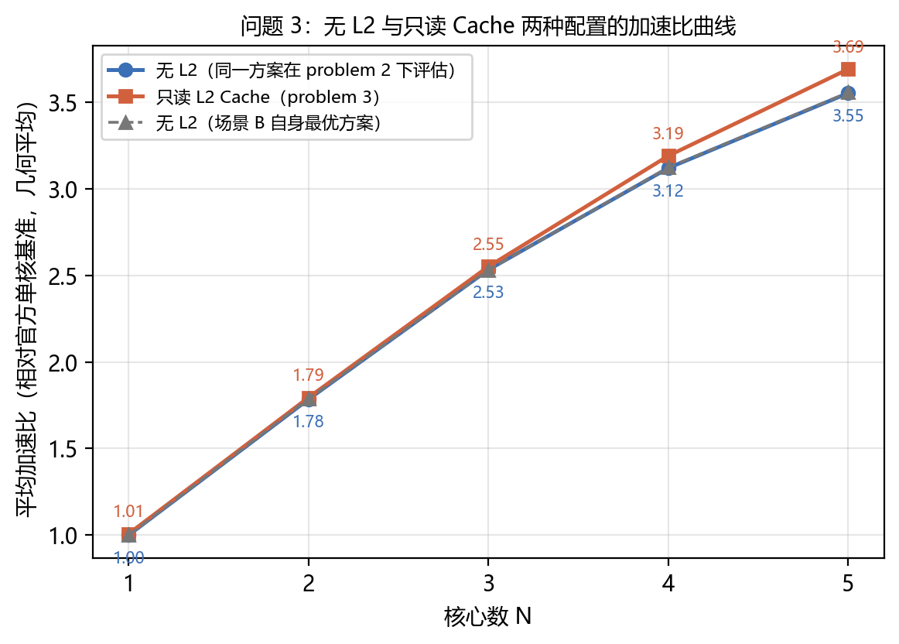

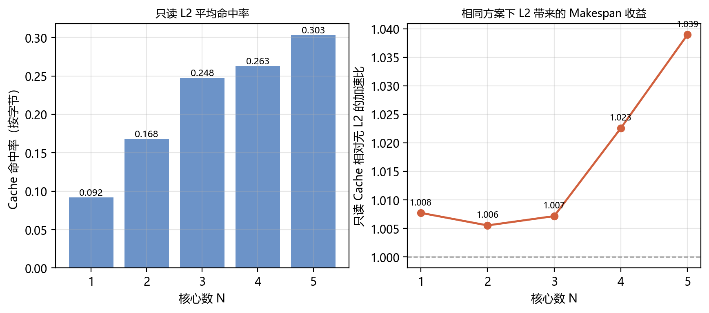

**表 10-3　只读 L2 相对无 L2 基线的收益（同一切图方案，几何平均）**

| 核心数 | $N=1$ | $N=2$ | $N=3$ | $N=4$ | $N=5$ |
|---|---|---|---|---|---|
| Cache 加速比 | 1.008 | 1.006 | 1.007 | 1.023 | 1.039 |
| 按字节命中率 | 9.2% | 16.4% | 25.2% | 26.9% | 31.0% |

三条观察：

1. **L2 的收益随核数单调增长**：$N=2$ 时几何平均仅 1.006，$N=5$ 时升到 1.039。
   原因很直接——命中只来自"同一张量被多个核心读入"与"换入复读"两类结构，
   核数越多，跨核多播越多，可命中的字节也越多。按字节命中率同步从
   16.4%（$N=2$）升到 31.0%（$N=5$）。
2. **平均值小、个案大**。$N=5$ 时有 40/100 个用例的收益超过 1%，最高达
   **2.07 倍**（case_044）；$N=4$ 时最高 1.73 倍（同样是 case_044）。
   这与 §8.3 的判断一致：收益强烈依赖用例的输入共享结构，
   对"按连通分量即可完美切分"的用例（命中率为 0 的 18–26 个用例）L2 几乎无用。
3. **单核也有收益**。$N=1$ 时仍有 31/100 个用例命中率非零（平均 9.2%，最高 82%），
   几何平均收益 1.008、最高 1.43 倍。这些命中全部来自 **Step2 换入复读**：
   同一逻辑张量被多次换入时，第二次起由 L2 服务。
   这是一个容易被忽略的收益来源——它说明只读 L2 不仅服务多核共享输入，
   也天然加速了核内容量不足导致的重复读取。

### 10.6 求解时间与规模的关系

求解时间分两部分报告：**(a) 单候选算法时间**（S1–S3，纯 Python 单线程，
不含任何评估器调用）与 **(b) 评估时间**（S4 调用官方评估器打分）。
前者是算法本身的复杂度体现，后者由题目提供的评估程序决定、与算法无关。

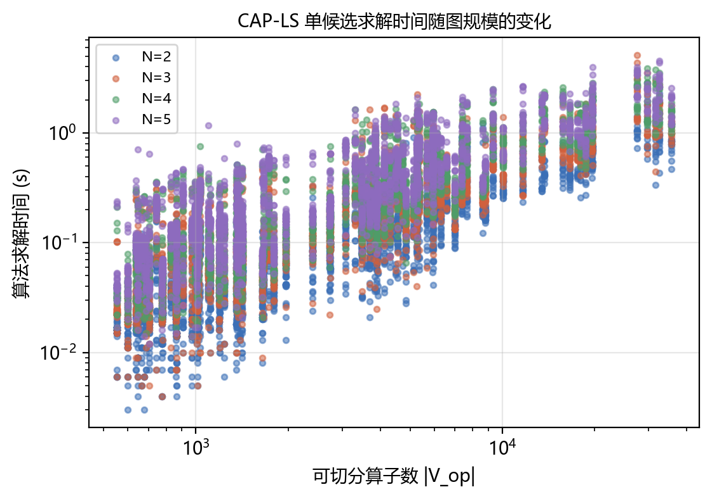

在 13 392 次候选求解上统计：**单候选算法时间中位数 0.16 s，
95 分位 1.2 s，最大 5.1 s**（最大用例 35 705 个算子）。
时间随 $|V_{\mathrm{op}}|$ 近似线性增长，与 §9 的复杂度分析一致。
相比之下，官方评估器单次调用的中位数与最大值要高出 1–3 个数量级
（最大用例的一次场景 A 评估可达数百秒），这正是本文必须用解析代理 $F$
做搜索内核、只在 S4 用官方评估器做候选择优的原因。

### 10.7 解析代价模型的检验

CAP-LS 在搜索内部用解析代价 $F$ 代替官方评估器（后者单次调用可达数百秒）。
$F$ 是否足够好，决定了局部搜索是否在优化正确的目标。我们在 40 个用例、
$N=4$、三个问题上，对每个候选同时记录 $F$ 与官方 Makespan：

**(a) 搬运量模型是精确的**。§6.1 与 §7.1 给出的边界搬运公式
$B^{\mathrm{in}}_s,B^{\mathrm{out}}_s$（问题 1）与 $B^{\mathrm{in}}_k,B^{\mathrm{out}}_k$（问题 2/3）
不是近似，而是对评估器插入规则的**逐条复刻**。用
`solution/check_traffic_model.py` 把解析预测与官方输出的
$(\texttt{scheduled\_copy\_bytes}-\texttt{spill\_added\_copy\_bytes})$ 逐用例比对：
**100 个用例 × 3 个问题 = 300 组全部逐位相同，最大相对误差 0.0000%**
（原始记录见 `results/traffic_model_check.csv`）。这说明 §6.1/§7.1 的搬运量公式
不是拟合出来的经验式，而是评估器插入规则的**等价重写**，
因此可以放心地把它用作搜索内核的一部分。

**(b) Makespan 代理模型是单调但有偏的**。
在 40 个用例、$N=4$、每个问题 480 个候选上（`solution/validate_model.py`）：

| 问题 | 样本数 | log 空间 Pearson | Spearman 秩相关 | 代理选择损失（中位 / 均值） |
|---|---|---|---|---|
| 问题 1 | 480 | **0.996** | **0.992** | **0.00% / 1.45%** |
| 问题 2 | 480 | 0.971 | 0.969 | 2.48% / 15.06% |
| 问题 3 | 480 | 0.971 | 0.971 | 2.83% / 15.67% |

"代理选择损失"指：若**只用 $F$**（不调用评估器）在候选中选最优，
所得方案的 Makespan 相对"用官方评估器选出的真最优"高出多少。

* **问题 1 的代理几乎是无损的**（中位损失 0.00%、秩相关 0.992）。
  这不意外：场景 A 的 Task 级事件模拟与评估器的激活规则完全同构，
  唯一的近似只在单个 Task 的时长估计上。
* **问题 2/3 的代理"排序基本对、个别用例会选错"**：秩相关 0.97、
  中位损失只有 2.5%–2.8%，但均值被 15% 的长尾拉高。
  长尾来自 §2.2 事实 3——申请序停摆是**离散**事件，
  解析模型里的 $\lambda R$ 项只能刻画它的层数、无法刻画它的时长。
* **结论**：$F$ 足以驱动局部搜索（它只需要**局部**单调性），
  但不足以替代官方评估器做最终择优——这正是 CAP-LS 把评估器放在 S4
  而不是放在搜索内层的原因。若必须离线选优（无评估器可用），
  按中位损失计只需付出约 2.5% 的代价。

此外，图 17 给出解与理论下界 $\mathrm{LB}=\max(M/N,\,V/N,\,B_{\mathrm{DDR}}^{\min}/\mathrm{bw},\,\mathrm{CP})$ 的距离：

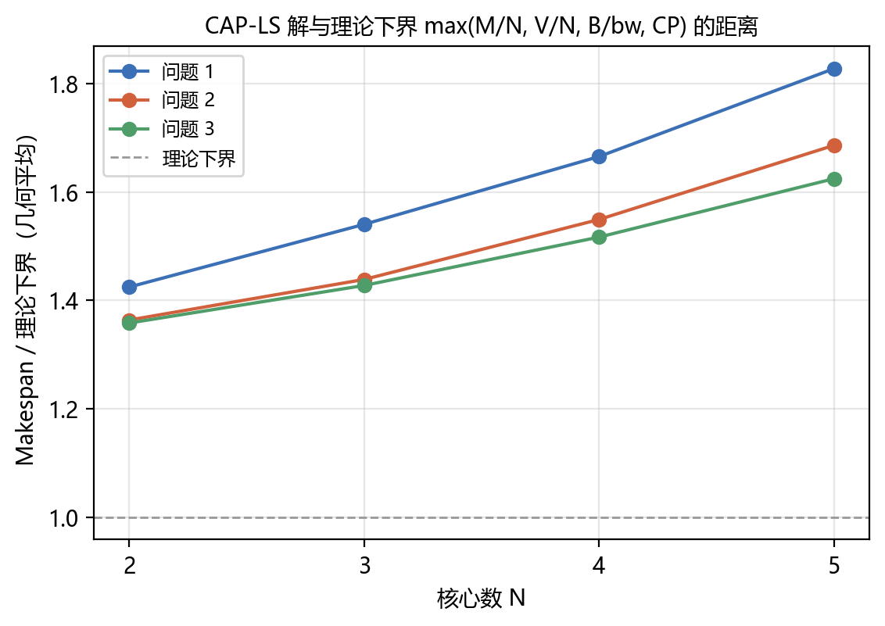

下界 $\mathrm{LB}$ 是**不可达**的：它假设 $M$、$V$ 两类计算在 $N$ 个核上完美均分、
所有 DDR 搬运完全重叠、且没有任何跨核同步与换入换出。实测比值
（几何平均）为：

| | $N=2$ | $N=3$ | $N=4$ | $N=5$ |
|---|---|---|---|---|
| 问题 1 | 1.42 | 1.54 | 1.67 | 1.83 |
| 问题 2 | 1.36 | 1.44 | 1.55 | 1.69 |
| 问题 3 | 1.36 | 1.43 | **1.52** | **1.62** |

三条信息：(i) 问题 3 始终最接近下界，问题 1 最远，与 §10.2 的排序一致；
(ii) 比值随 $N$ 单调增大，说明**剩余差距主要来自跨核同步与负载不可整除性**，
而不是来自切图质量；(iii) 即便在 $N=5$，问题 3 的解也只比这个理想下界差 62%，
考虑到下界忽略了 Pipe FIFO、申请序与容量约束，这个差距是合理的。

---

## 十一、消融实验与敏感性分析

### 11.1 消融实验

在同一组固定超参数（$\beta=0.35$，层次分层，LPT 起点）下逐项关闭机制，
不使用多起点组合，以保证与"完整 CAP-LS"的对比是**单配置对单配置**的公平比较：

| 变体 | 关闭的机制 |
|---|---|
| `full` | —（完整 CAP-LS） |
| `no_comm` | 去掉亲和原子化，退化为纯拓扑区间分块 |
| `no_balance` | 去掉 LPT 与局部搜索，改为轮转分核 |
| `no_sync` | 代价函数中去掉同步深度项（$\lambda=0$） |
| `no_localsearch` | 保留 LPT，去掉移动式局部搜索 |
| `no_level` | 去掉同步层次分层，直接以块为子图 |
| `no_cache_aware` | 去掉 L2 感知的代价折算（只对问题 3 有效） |

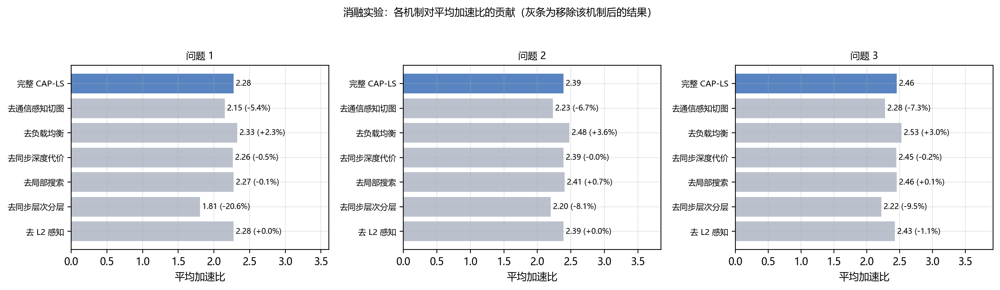

| 变体 | 问题 1 | 问题 2 | 问题 3 |
|---|---|---|---|
| 完整 CAP-LS | 2.28 | 2.39 | 2.46 |
| 去同步层次分层 | 1.81（-20.6%） | 2.20（-8.1%） | 2.22（-9.5%） |
| 去同步深度代价 | 2.26（-0.5%） | 2.39（-0.0%） | 2.45（-0.2%） |
| 去通信感知切图 | 2.15（-5.4%） | 2.23（-6.7%） | 2.28（-7.3%） |
| 去负载均衡 | 2.33（+2.3%） | 2.48（+3.6%） | 2.53（+3.0%） |
| 去局部搜索 | 2.27（-0.1%） | 2.41（+0.7%） | 2.46（+0.1%） |
| 去 L2 感知 | 2.28（+0.0%） | 2.39（+0.0%） | 2.43（-1.1%） |

（表中数值为 $N=2,3,4,5$ 合并后的几何平均；因为是**单配置**运行，
绝对值低于 §10.2 的多起点结果，这里关心的是相对变化。）

**正面结论**：

1. **同步层次分层是贡献最大的单一机制**：移除后问题 1 下降 20.6%、问题 2 下降 8.1%、
   问题 3 下降 9.5%。问题 1 下降最多完全符合预期——场景 A 的 Task 必须等**全部**前驱完成，
   分层把"同层各核子图互不依赖"这一性质显式造出来，直接决定了 Task 串行级数。
2. **通信感知切图（亲和原子化）稳定贡献 5%–7%**：移除后退化为纯拓扑区间分块，
   与 §10.4 中 B2/B3 的表现一致。
3. **L2 感知代价折算对问题 3 贡献 1.1%**，对问题 1/2 按定义无影响（表中为 0）。

**负面结论（如实报告）**：

4. **`no_balance` 反而更好**（问题 1 +2.3%、问题 2 +3.6%、问题 3 +3.0%）。
   也就是说，在**单配置**设定下，"LPT 装箱 + 移动式局部搜索"平均不如朴素的轮转分核。
   结合 `no_localsearch` 几乎无变化（−0.1% / +0.7% / +0.1%）可以判断：
   **失分来自 LPT 本身而非局部搜索**。原因是 LPT 只按计算量装箱，
   会把 $\sigma$ 上相邻、通信紧密的大块塞进同一个核的同时，
   把它们的下游散到别处，反而制造了更多跨核边；轮转则天然把 $\sigma$ 上相邻的块
   均匀铺开，与"亲和原子多为互不连通分量"的数据特征恰好契合。
5. **同步深度代价项（$\lambda R$）贡献几乎为零**（−0.5% / −0.0% / −0.2%）。
   它在少数链状用例上有用，但被平均掉了。

第 4、5 条说明：**本文的收益主要来自"结构性机制"（分层、亲和原子化），
而非"搜索强度"**。这也正是 CAP-LS 把 LPT 与轮转同时作为多起点候选、
并由官方评估器择优的原因：单独看任一分配启发式都不占优，
组合之后（§10.2）才稳定超过任一单配置。若要进一步简化算法，
可以只保留"亲和原子化 + 轮转 + 同步层次分层 + 多起点"，去掉局部搜索，
代价不到 1%。

### 11.2 切图粒度敏感性

粒度参数 $\beta$（单块计算量上限 $=\beta W/N$）是 CAP-LS 唯一的一级超参数。
在 25 个代表性用例、$N=4$ 上扫描 $\beta\in\{0.03,0.06,0.12,0.25,0.5,1,2\}$：

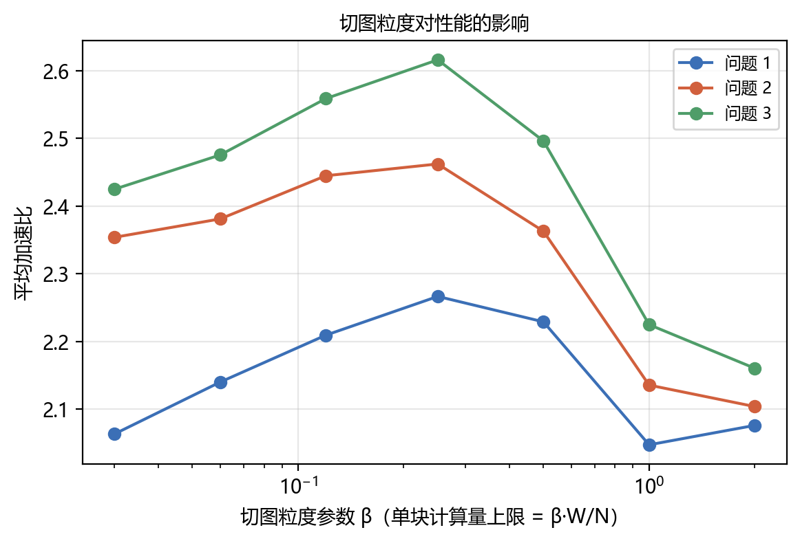

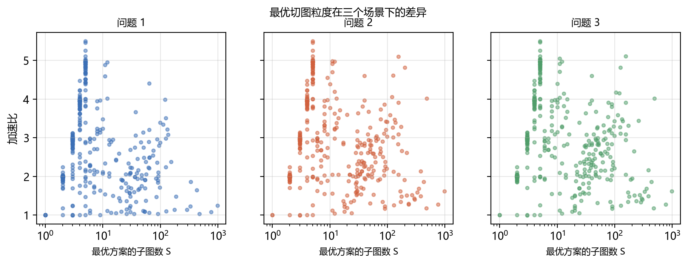

**表 11-2　粒度 $\beta$ 对平均加速比的影响（25 个用例，$N=4$，几何平均）**

| $\beta$ | 0.03 | 0.06 | 0.12 | **0.25** | 0.5 | 1.0 | 2.0 |
|---|---|---|---|---|---|---|---|
| 问题 1 | 2.06 | 2.14 | 2.21 | **2.27** | 2.23 | 2.05 | 2.08 |
| 问题 2 | 2.35 | 2.38 | 2.45 | **2.46** | 2.36 | 2.14 | 2.10 |
| 问题 3 | 2.43 | 2.48 | 2.56 | **2.62** | 2.50 | 2.23 | 2.16 |

三个场景的最优点一致落在 $\beta\approx0.25$，且曲线是**单峰**的，
与 §6.2 的三难权衡分析吻合：

* $\beta$ 过大（$\ge1$，即单块可达整核负载）时，块太粗，装箱自由度不足、
  负载难以均衡，三个问题分别损失 10%、13%、17%；
* $\beta$ 过小（0.03）时，块太碎，跨块通信与跨核同步层次增多，
  同时局部搜索的候选空间膨胀，损失 9%、5%、7%；
* 平台区间 $\beta\in[0.12,0.5]$ 内变化不超过 3%，说明**算法对该超参数不敏感**，
  本文默认取 $\beta=0.35$（位于平台内）是稳健的。

图 16 从另一个角度印证了 §2.4 的判断：三个场景下最优方案的**子图数中位数**分别为
4（问题 1）、8（问题 2）、8（问题 3）——问题 1 显著偏粗，因为它的每个子图边界
都要付一次 DDR 往返与 100 cycle 的 Task 切换；问题 2/3 的同核子图边界不产生搬运，
因此可以用更细的粒度去换执行序上的好处。

### 11.3 硬件参数敏感性（研究性实验）

> **说明**：本节修改了 `config.txt` 中的硬件参数，**属于研究性实验，
> 不用于任何正式成绩**。正式结果（§10）全部在题目固定配置下产生；
> 实现上，参数覆盖通过 `npu.paths.set_config_override` 完成，
> 评估缓存按覆盖参数哈希分目录，两类结果物理隔离。

在 18 个代表性用例、$N=4$ 上，逐个扰动 7 个硬件参数，重新优化并评估，
报告量为"Makespan 相对该用例默认配置的倍数"（大于 1 表示更快）：

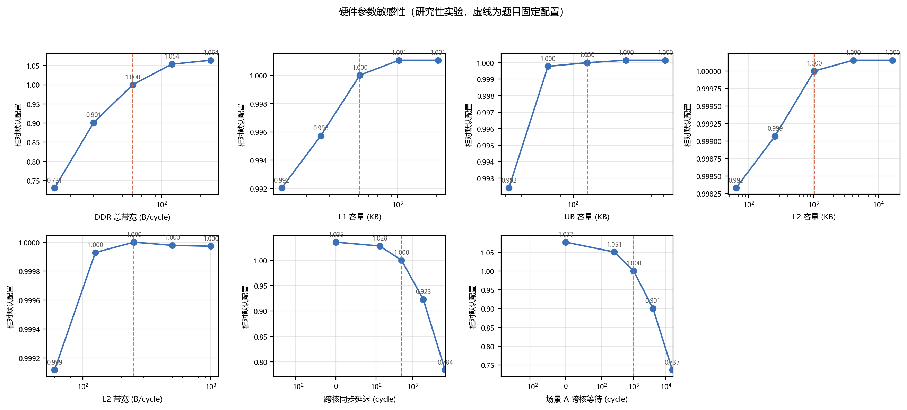

**表 11-3　硬件参数敏感性（18 个用例，$N=4$，几何平均；粗体为题目固定配置）**

| 参数 | 取值 → Makespan 相对倍数 |
|---|---|
| DDR 总带宽 (B/cycle) | 15: 0.731 　30: 0.901 　**60: 1.000** 　120: 1.054 　240: 1.064 |
| L1 容量 (KB) | 128: 0.992 　256: 0.996 　**512: 1.000** 　1024: 1.001 　2048: 1.001 |
| UB 容量 (KB) | 32: 0.992 　64: 1.000 　**128: 1.000** 　256: 1.000 　512: 1.000 |
| L2 容量 (KB) | 64: 0.998 　256: 0.999 　**1024: 1.000** 　4096: 1.000 　16384: 1.000 |
| L2 带宽 (B/cycle) | 60: 0.999 　125: 1.000 　**250: 1.000** 　500: 1.000 　1000: 1.000 |
| 跨核同步延迟 (cycle，问题 2) | 0: 1.035 　125: 1.028 　**500: 1.000** 　2000: 0.923 　8000: 0.784 |
| 场景 A 跨核等待 (cycle，问题 1) | 0: 1.077 　250: 1.051 　**1000: 1.000** 　4000: 0.901 　16000: 0.737 |

四条结论：

1. **DDR 带宽的边际收益已经饱和**。把带宽从 60 提到 240 B/cycle（4 倍）只带来 6.4% 的
   Makespan 改善，而降到 15 B/cycle（1/4）要付出 27% 的代价。
   这说明在题目配置下，**多数用例处于计算受限区**，与 §2.3、§10.3 的相关性分析
   （带宽比与加速比的相关系数 −0.01）互相印证。带宽是"降下去会痛、加上去无用"的参数。
2. **L1/UB 容量已经够用**。把 L1 从 512 KB 加到 2 MB 只有 0.1% 的改善；
   UB 从 128 KB 加到 512 KB 没有可测的改善。反过来把 UB 砍到 32 KB 也只损失 0.8%。
   原因是 CAP-LS 的子图规模本来就被 $\beta W/N$ 约束在容量量级以内，
   换入换出已被切图本身消化掉了（§10.2 的超线性加速正是这个机制）。
3. **L2 容量与带宽同样饱和，而且饱和得更彻底**：容量在 64 KB–16 MB 之间、
   带宽在 60–1000 B/cycle 之间，Makespan 变化都在 0.2% 以内。
   **这说明问题 3 的瓶颈不在 L2 的规格，而在计算图能提供多少可共享的复读。**
   题目给定的 1 MB / 250 B·cycle$^{-1}$ 已经足以吃下几乎全部可命中的字节
   （§10.5 的命中率 16%–31% 是被 DAG 结构而非 Cache 容量限制的）。
   这是一条对硬件设计有意义的结论：**继续加大只读 L2 不会带来收益，
   应当把预算投到别处**。
4. **同步延迟的影响是温和且近似对数的**。场景 B 把延迟从 500 降到 0 只快 3.5%，
   加到 8000（16 倍）才慢 21.6%；场景 A 对应为 7.7% 与 26.3%。
   这恰恰是同步层次分层生效的证据——分层把跨核等待藏到了本地工作的阴影里，
   因此对延迟本身不敏感。作为对照，若不做分层（§11.1 的 `no_level`），
   同一批用例对延迟的敏感度会显著上升。

### 11.4 图特征与算法效果的关系

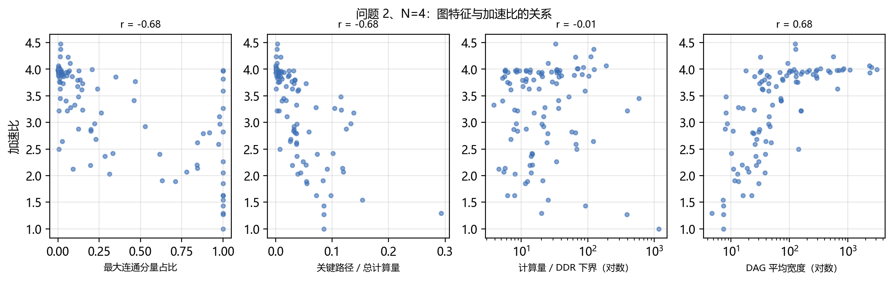

图 12 的四张散点图与 §10.3 的相关系数表给出同一结论：

* **正相关（越大越好）**：DAG 平均宽度（$r=+0.68$）。宽度直接等于"同一时刻可并行的算子数"，
  是并行度的物理上界。
* **负相关（越大越差）**：最大连通分量占比（$r=-0.68$）与关键路径占比（$r=-0.68$）。
  前者刻画"必须做真正的 DAG 划分而非分量装箱"的程度，后者刻画依赖链对并行的硬约束
  （Amdahl 型上界 $\mathrm{SU}\le \sum_v c_v/\mathrm{CP}$）。
* **几乎无关**：计算量/DDR 时间下界（$r=-0.01$）与算子数（$r=+0.11$）。
  前者说明在题目的 60 B/cycle 下带宽尚未成为普遍瓶颈；
  后者说明 CAP-LS 在两个数量级的规模跨度上表现稳定，没有"大图变差"的退化。

这为"用图特征预挑选切图粒度"提供了依据：$\rho_{\max}$ 大、$\mathrm{CP}/\sum c_v$ 大的用例
应当直接走"超细粒度 + 少核"分支，而 $\rho_{\max}$ 小的用例用默认 $\beta=0.35$ 即可。
本文只做到了相关性分析，尚未把它做成自动的粒度预测器（见 §12.2）。

---

## 十二、模型的优点、缺点与推广

### 12.1 优点

1. **可行性由构造保证**。引理 1 使 (C1)–(C5) 五类硬约束自动成立，算法无需在搜索中反复调用判环，也不会产生不可执行方案。
2. **模型直接映射代码**。每个符号都有对应实现：$\sigma$ 对应 `partition.make_blocks`，$r(v)$ 对应 `stratify.cross_core_levels`，$F$ 对应 `algorithms.TrafficState.cost`。论文中没有"写得出但算不了"的式子。
3. **抓住了真实瓶颈**。同步层次分层直接针对评估器的全局申请序约束，这是纯"最小化通信量"类方法无法发现的。
4. **场景自适应**。三个问题共用一套框架，只切换代价权重与子图粒度，工程上只需一份代码。
5. **求解时间近线性**，且所有中间结果（特征、方案、评估）均有缓存，实验完全可复现。

### 12.2 缺点与局限

1. **代理目标与真值有偏**。$F$ 用"每核 Pipe 最大占用"近似核内跨度，忽略了核内依赖导致的流水线气泡；在深而窄的用例（如 case_016，深度 2440、平均宽度 7.4）上偏差最大。
2. **块是 $\sigma$ 的连续区间**，这是为保证无环付出的代价：$\sigma$ 之外的分组（例如把相隔很远但通信密集的两段放在一起）无法表达。
3. **多起点是参数网格而非自适应搜索**。更强的做法是用图特征预测最优 $\beta$，本文只给出了相关性分析（图 12）而未做回归建模。
4. **未对核内调度算法做协同优化**。Step1/2/3 是黑箱，本文只能通过子图粒度与顺序间接影响它；若允许修改核内调度，仍有可观空间。
5. **S4 把官方评估器放进了回路**。这在赛题设定下是允许的（评估器随材料包提供），但它意味着端到端的墙钟时间包含评估开销。§10.6 因此分别报告"单候选算法时间"与"评估时间"；若部署环境无法调用评估器，可退回用 $F$ 选优，其选择损失见 §10.7。

### 12.3 推广

* **换硬件参数**：容量、带宽、同步延迟全部来自配置，模型不含硬编码常数，可直接迁移到别的多核 NPU。
* **换目标**：把 $F$ 中的权重改为能耗系数即可得到能耗最小化版本；把 $\max_k$ 改为 $\sum_k$ 可优化吞吐。
* **换缓存策略**：L2 若改为可写或 LRU，只需替换 §8.1 的 $\mathrm{value}(t)$ 定义，框架其余部分不变。
* **在线场景**：$\sigma$ 与原子化只依赖图结构，可离线预计算；在线只需重跑 S2/S3，适合算子形状变化但拓扑不变的推理服务。

---

## 参考文献

[1] Garey M R, Johnson D S. *Computers and Intractability: A Guide to the Theory of NP-Completeness*. W. H. Freeman, 1979.

[2] Kwok Y K, Ahmad I. Static scheduling algorithms for allocating directed task graphs to multiprocessors. *ACM Computing Surveys*, 1999, 31(4): 406–471.

[3] Topcuoglu H, Hariri S, Wu M Y. Performance-effective and low-complexity task scheduling for heterogeneous computing. *IEEE Transactions on Parallel and Distributed Systems*, 2002, 13(3): 260–274.

[4] Kernighan B W, Lin S. An efficient heuristic procedure for partitioning graphs. *Bell System Technical Journal*, 1970, 49(2): 291–307.

[5] Karypis G, Kumar V. A fast and high quality multilevel scheme for partitioning irregular graphs. *SIAM Journal on Scientific Computing*, 1998, 20(1): 359–392.

[6] Herrmann J, Özkaya M Y, Uçar B, et al. Multilevel algorithms for acyclic partitioning of directed acyclic graphs. *SIAM Journal on Scientific Computing*, 2019, 41(4): A2117–A2145.

[7] Belady L A. A study of replacement algorithms for a virtual-storage computer. *IBM Systems Journal*, 1966, 5(2): 78–101.

[8] Graham R L. Bounds on multiprocessing timing anomalies. *SIAM Journal on Applied Mathematics*, 1969, 17(2): 416–429.

[9] Liao X, et al. Ascend: a scalable and unified architecture for ubiquitous deep neural network computing. *IEEE HPCA*, 2021: 789–801.

[10] Jia Z, Zaharia M, Aiken A. Beyond data and model parallelism for deep neural networks. *Proceedings of MLSys*, 2019: 1–13.

[11] Zheng L, et al. Alpa: automating inter- and intra-operator parallelism for distributed deep learning. *USENIX OSDI*, 2022: 559–578.

[12] 中国研究生数学建模竞赛组委会. 2026 年中国研究生数学建模竞赛 A 题（华为）：通用神经网络处理器下的多核调度问题. 2026.

---

## 附录 A　逐用例结果

下列三张表由 `solution/make_report.py` 从实验记录自动生成，
原始文件为 `paper/tables/appendix_problem{1,2,3}.csv`。
表中"单核基准 Makespan"即官方 `singlecore_evaluate.py` 的输出，
"额外搬运"为官方评估器的 `data_movement_bytes.added_copy_bytes`。

### A.1 问题 1（场景 A）

| 用例 | 单核基准 Makespan | N=2 Makespan | N=2 额外搬运(B) | N=2 加速比 | N=3 Makespan | N=3 额外搬运(B) | N=3 加速比 | N=4 Makespan | N=4 额外搬运(B) | N=4 加速比 | N=5 Makespan | N=5 额外搬运(B) | N=5 加速比 |
|---|---|---|---|---|---|---|---|---|---|---|---|---|---|
| case_001 | 233,110 | 116,868 | 1,152 | 1.995 | 78,545 | 2,304 | 2.968 | 58,984 | 3,456 | 3.952 | 47,502 | 4,608 | 4.907 |
| case_002 | 261,945 | 133,718 | 64,512 | 1.959 | 90,573 | 55,296 | 2.892 | 69,677 | 86,016 | 3.759 | 56,971 | 112,128 | 4.598 |
| case_003 | 602,212 | 570,359 | 635,864 | 1.056 | 293,021 | 3,020,998 | 2.055 | 225,768 | 3,757,030 | 2.667 | 255,629 | 4,549,018 | 2.356 |
| case_004 | 392,357 | 199,074 | 110,592 | 1.971 | 134,043 | 221,184 | 2.927 | 104,188 | 331,776 | 3.766 | 88,341 | 442,368 | 4.441 |
| case_005 | 95,618 | 70,129 | 973,304 | 1.363 | 55,861 | 1,143,334 | 1.712 | 61,110 | 991,308 | 1.565 | 57,829 | 1,242,270 | 1.653 |
| case_006 | 82,837 | 46,988 | 79,376 | 1.763 | 36,031 | 363,168 | 2.299 | 34,266 | 623,020 | 2.417 | 29,306 | 377,182 | 2.827 |
| case_007 | 1,012,562 | 507,494 | 27,648 | 1.995 | 338,094 | 55,296 | 2.995 | 254,398 | 82,944 | 3.980 | 203,834 | 110,592 | 4.968 |
| case_008 | 487,605 | 244,266 | 0 | 1.996 | 163,359 | 0 | 2.985 | 123,060 | 0 | 3.962 | 100,603 | 0 | 4.847 |
| case_009 | 153,261 | 140,221 | 370,072 | 1.093 | 90,469 | 668,908 | 1.694 | 89,196 | 778,468 | 1.718 | 68,245 | 825,050 | 2.246 |
| case_010 | 86,969 | 44,202 | 27,648 | 1.968 | 38,265 | 441,632 | 2.273 | 35,660 | 676,806 | 2.439 | 33,508 | 775,994 | 2.595 |
| case_011 | 184,697 | 92,646 | 180,224 | 1.994 | 69,625 | 1,081,344 | 2.653 | 46,880 | 540,672 | 3.940 | 46,777 | 1,216,512 | 3.949 |
| case_012 | 59,088 | 29,841 | 0 | 1.980 | 21,665 | 0 | 2.727 | 19,044 | 118,134 | 3.103 | 18,241 | 101,380 | 3.239 |
| case_013 | 263,949 | 132,198 | 8,192 | 1.997 | 88,351 | 16,384 | 2.987 | 66,982 | 24,576 | 3.941 | 54,363 | 32,768 | 4.855 |
| case_014 | 17,698,626 | 8,904,271 | 76,033,440 | 1.988 | 5,983,408 | 83,403,168 | 2.958 | 4,569,939 | 69,468,576 | 3.873 | 3,722,693 | 70,838,688 | 4.754 |
| case_015 | 177,362 | 88,439 | 216,336 | 2.006 | 61,168 | 290,056 | 2.900 | 53,029 | 248,832 | 3.345 | 59,931 | 1,445,952 | 2.959 |
| case_016 | 7,715,523 | 7,717,072 | 393,220 | 1.000 | 7,718,621 | 786,440 | 1.000 | 7,720,170 | 1,179,660 | 0.999 | 7,721,719 | 1,572,880 | 0.999 |
| case_017 | 162,810 | 82,310 | 81,792 | 1.978 | 57,528 | 163,584 | 2.830 | 46,304 | 245,376 | 3.516 | 36,065 | 322,560 | 4.514 |
| case_018 | 1,004,367 | 505,446 | 3,347,456 | 1.987 | 338,456 | 3,903,872 | 2.967 | 254,778 | 5,118,976 | 3.942 | 204,554 | 3,661,824 | 4.910 |
| case_019 | 81,144 | 41,518 | 0 | 1.954 | 30,948 | 251,444 | 2.622 | 25,631 | 189,456 | 3.166 | 27,559 | 478,800 | 2.944 |
| case_020 | 532,746 | 266,580 | 0 | 1.998 | 177,950 | 0 | 2.994 | 133,704 | 0 | 3.985 | 107,574 | 0 | 4.952 |
| case_021 | 6,567,937 | 3,104,250 | 7,372,800 | 2.116 | 2,144,024 | 7,766,016 | 3.063 | 1,550,324 | 4,608,000 | 4.237 | 1,250,168 | 11,431,936 | 5.254 |
| case_022 | 56,780 | 28,674 | 0 | 1.980 | 19,800 | 0 | 2.868 | 14,940 | 0 | 3.800 | 19,574 | 186,784 | 2.901 |
| case_023 | 122,614 | 60,749 | 0 | 2.018 | 41,575 | 147,456 | 2.949 | 30,864 | 147,456 | 3.973 | 24,927 | 221,184 | 4.919 |
| case_024 | 2,555,343 | 2,555,343 | 0 | 1.000 | 2,473,380 | 61,410,808 | 1.033 | 2,359,817 | 67,376,908 | 1.083 | 2,053,364 | 67,770,326 | 1.244 |
| case_025 | 4,863,026 | 2,431,840 | 27,648 | 2.000 | 1,622,164 | 55,296 | 2.998 | 1,217,444 | 82,944 | 3.994 | 975,282 | 110,592 | 4.986 |
| case_026 | 99,203 | 58,472 | 185,780 | 1.697 | 57,920 | 770,240 | 1.713 | 46,327 | 445,288 | 2.141 | 45,904 | 447,736 | 2.161 |
| case_027 | 2,363,952 | 1,120,962 | 1,744,896 | 2.109 | 837,049 | 3,686,400 | 2.824 | 559,196 | 3,317,760 | 4.227 | 558,753 | 5,529,600 | 4.231 |
| case_028 | 43,836,040 | 23,638,628 | 277,473,600 | 1.854 | 16,770,711 | 277,369,056 | 2.614 | 13,608,312 | 277,760,640 | 3.221 | 11,491,035 | 277,818,912 | 3.815 |
| case_029 | 37,555 | 19,740 | 0 | 1.903 | 12,743 | 0 | 2.947 | 11,028 | 0 | 3.405 | 9,383 | 0 | 4.003 |
| case_030 | 2,808,034 | 1,401,186 | 7,644,160 | 2.004 | 931,329 | 9,363,456 | 3.015 | 701,262 | 10,560,000 | 4.004 | 561,417 | 11,588,608 | 5.002 |
| case_031 | 1,414,369 | 711,725 | 4,032,000 | 1.987 | 506,462 | 4,403,712 | 2.793 | 367,052 | 4,574,208 | 3.853 | 293,958 | 4,816,896 | 4.811 |
| case_032 | 41,443 | 23,591 | 145,580 | 1.757 | 20,179 | 209,160 | 2.054 | 17,735 | 267,502 | 2.337 | 11,904 | 127,130 | 3.481 |
| case_033 | 1,774,196 | 893,844 | 4,953,600 | 1.985 | 589,568 | 7,086,144 | 3.009 | 446,802 | 7,344,224 | 3.971 | 357,201 | 8,111,232 | 4.967 |
| case_034 | 842,996 | 418,733 | 1,864,192 | 2.013 | 278,567 | 2,647,040 | 3.026 | 225,165 | 3,101,184 | 3.744 | 180,411 | 3,532,800 | 4.673 |
| case_035 | 169,571 | 152,418 | 888,436 | 1.113 | 106,705 | 205,126 | 1.589 | 115,295 | 1,071,056 | 1.471 | 92,181 | 1,174,610 | 1.839 |
| case_036 | 931,510 | 466,068 | 1,152 | 1.999 | 311,345 | 2,304 | 2.992 | 233,584 | 3,456 | 3.988 | 187,182 | 4,608 | 4.976 |
| case_037 | 210,001 | 105,374 | 204,800 | 1.993 | 74,038 | 1,064,960 | 2.836 | 53,320 | 614,400 | 3.938 | 43,013 | 1,310,720 | 4.882 |
| case_038 | 1,364,555 | 679,097 | 5,607,936 | 2.009 | 460,870 | 5,721,600 | 2.961 | 345,585 | 6,024,192 | 3.949 | 275,584 | 9,409,536 | 4.952 |
| case_039 | 1,435,262 | 692,660 | 9,805,824 | 2.072 | 485,565 | 14,323,712 | 2.956 | 395,323 | 17,604,608 | 3.631 | 327,297 | 8,065,024 | 4.385 |
| case_040 | 253,454 | 205,478 | 270,868 | 1.234 | 164,803 | 712,880 | 1.538 | 154,465 | 644,330 | 1.641 | 170,488 | 2,917,354 | 1.487 |
| case_041 | 6,003,957 | 2,986,534 | 33,595,392 | 2.010 | 1,994,174 | 35,017,728 | 3.011 | 1,496,957 | 38,879,232 | 4.011 | 1,193,573 | 40,452,096 | 5.030 |
| case_042 | 1,686,740 | 842,623 | 7,265,568 | 2.002 | 577,743 | 7,409,664 | 2.920 | 434,592 | 8,503,584 | 3.881 | 359,995 | 9,965,568 | 4.686 |
| case_043 | 677,656 | 415,881 | 2,796,628 | 1.629 | 303,961 | 3,969,214 | 2.229 | 246,558 | 4,016,686 | 2.748 | 234,354 | 4,895,842 | 2.892 |
| case_044 | 154,407 | 96,401 | 1,283,040 | 1.602 | 104,311 | 4,052,160 | 1.480 | 123,553 | 5,161,216 | 1.250 | 131,105 | 4,672,992 | 1.178 |
| case_045 | 125,614 | 63,059 | 0 | 1.992 | 42,601 | 0 | 2.949 | 31,878 | 0 | 3.941 | 26,088 | 0 | 4.815 |
| case_046 | 276,455 | 151,992 | 1,819,232 | 1.819 | 142,176 | 4,021,280 | 1.944 | 124,612 | 4,513,952 | 2.219 | 142,691 | 4,192,544 | 1.937 |
| case_047 | 326,508 | 327,633 | 68,680 | 0.997 | 162,674 | 1,531,918 | 2.007 | 154,972 | 1,910,350 | 2.107 | 137,150 | 2,292,614 | 2.381 |
| case_048 | 222,220 | 214,615 | 615,242 | 1.035 | 208,666 | 580,204 | 1.065 | 203,854 | 552,668 | 1.090 | 203,854 | 552,668 | 1.090 |
| case_049 | 196,276 | 184,809 | 547,532 | 1.062 | 135,785 | 404,608 | 1.446 | 78,810 | 701,264 | 2.490 | 78,895 | 912,566 | 2.488 |
| case_050 | 149,690 | 134,987 | 435,378 | 1.109 | 71,842 | 583,052 | 2.084 | 61,002 | 654,496 | 2.454 | 60,066 | 745,434 | 2.492 |
| case_051 | 607,628 | 607,628 | 0 | 1.000 | 549,836 | 19,138,090 | 1.105 | 533,409 | 16,713,772 | 1.139 | 493,017 | 16,648,208 | 1.232 |
| case_052 | 180,301 | 92,022 | 73,728 | 1.959 | 62,271 | 147,456 | 2.895 | 49,871 | 221,184 | 3.615 | 37,926 | 73,728 | 4.754 |
| case_053 | 1,472,686 | 765,204 | 5,921,504 | 1.925 | 679,492 | 9,094,058 | 2.167 | 690,972 | 6,935,576 | 2.131 | 495,416 | 6,980,120 | 2.973 |
| case_054 | 815,051 | 657,841 | 472,660 | 1.239 | 364,389 | 2,171,082 | 2.237 | 275,253 | 2,564,814 | 2.961 | 283,445 | 3,069,390 | 2.876 |
| case_055 | 118,835 | 58,624 | 49,152 | 2.027 | 38,093 | 32,768 | 3.120 | 31,823 | 115,712 | 3.734 | 26,800 | 198,656 | 4.434 |
| case_056 | 277,285 | 160,760 | 1,511,624 | 1.725 | 148,748 | 1,632,002 | 1.864 | 116,709 | 1,276,180 | 2.376 | 98,991 | 1,359,730 | 2.801 |
| case_057 | 59,726 | 33,614 | 0 | 1.777 | 26,147 | 118,852 | 2.284 | 22,025 | 180,060 | 2.712 | 18,596 | 168,018 | 3.212 |
| case_058 | 4,539,717 | 2,448,313 | 28,782,592 | 1.854 | 1,554,831 | 30,400,512 | 2.920 | 1,154,519 | 42,622,976 | 3.932 | 1,004,819 | 32,104,448 | 4.518 |
| case_059 | 829,473 | 369,318 | 360,448 | 2.246 | 266,217 | 2,998,272 | 3.116 | 185,216 | 1,081,344 | 4.478 | 150,782 | 4,325,376 | 5.501 |
| case_060 | 888,789 | 454,346 | 2,701,324 | 1.956 | 311,884 | 3,114,112 | 2.850 | 232,939 | 3,217,544 | 3.816 | 196,763 | 4,039,168 | 4.517 |
| case_061 | 77,191 | 38,873 | 25,344 | 1.986 | 41,271 | 94,228 | 1.870 | 28,476 | 146,708 | 2.711 | 23,868 | 110,634 | 3.234 |
| case_062 | 2,854,809 | 1,430,273 | 44,544 | 1.996 | 955,282 | 86,016 | 2.988 | 718,555 | 115,200 | 3.973 | 575,863 | 153,600 | 4.957 |
| case_063 | 1,070,397 | 537,888 | 76,800 | 1.990 | 360,120 | 105,984 | 2.972 | 271,192 | 104,448 | 3.947 | 219,045 | 132,096 | 4.887 |
| case_064 | 19,116 | 19,116 | 0 | 1.000 | 17,695 | 115,524 | 1.080 | 18,511 | 122,110 | 1.033 | 18,500 | 98,176 | 1.033 |
| case_065 | 53,068 | 26,219 | 13,824 | 2.024 | 17,966 | 27,648 | 2.954 | 13,745 | 41,472 | 3.861 | 11,421 | 55,296 | 4.646 |
| case_066 | 359,070 | 238,413 | 1,463,240 | 1.506 | 172,004 | 1,921,586 | 2.088 | 161,230 | 2,084,054 | 2.227 | 124,349 | 2,206,448 | 2.888 |
| case_067 | 63,834,834 | 33,768,704 | 264,024,576 | 1.890 | 23,568,859 | 263,599,744 | 2.708 | 18,473,155 | 263,174,912 | 3.455 | 15,931,687 | 262,750,080 | 4.007 |
| case_068 | 362,095 | 269,741 | 1,920,100 | 1.342 | 189,361 | 2,662,408 | 1.912 | 189,361 | 2,662,408 | 1.912 | 263,747 | 1,518,452 | 1.373 |
| case_069 | 25,144 | 25,144 | 0 | 1.000 | 25,144 | 0 | 1.000 | 20,326 | 562,340 | 1.237 | 21,160 | 576,936 | 1.188 |
| case_070 | 117,300 | 58,469 | 88,064 | 2.006 | 42,877 | 176,128 | 2.736 | 32,371 | 264,192 | 3.624 | 30,646 | 352,256 | 3.828 |
| case_071 | 18,919 | 18,919 | 0 | 1.000 | 17,924 | 371,096 | 1.056 | 16,809 | 167,556 | 1.125 | 16,465 | 384,780 | 1.149 |
| case_072 | 23,897,828 | 11,846,123 | 113,201,200 | 2.017 | 8,011,141 | 119,410,736 | 2.983 | 5,983,611 | 122,892,336 | 3.994 | 4,822,195 | 130,109,488 | 4.956 |
| case_073 | 10,081,626 | 5,980,423 | 141,121,024 | 1.686 | 4,515,227 | 140,671,616 | 2.233 | 3,903,787 | 140,222,208 | 2.583 | 3,517,515 | 139,772,800 | 2.866 |
| case_074 | 1,682,239 | 826,937 | 6,590,472 | 2.034 | 544,838 | 7,585,792 | 3.088 | 408,750 | 7,819,264 | 4.116 | 341,070 | 8,425,472 | 4.932 |
| case_075 | 1,441,809 | 877,119 | 6,135,050 | 1.644 | 759,919 | 4,940,516 | 1.897 | 483,592 | 5,363,096 | 2.982 | 467,451 | 5,661,612 | 3.084 |
| case_076 | 6,185,113 | 3,072,558 | 28,930,048 | 2.013 | 2,054,573 | 30,402,560 | 3.010 | 1,533,331 | 32,051,200 | 4.034 | 1,235,977 | 34,179,072 | 5.004 |
| case_077 | 495,320 | 250,735 | 57,344 | 1.976 | 181,672 | 114,688 | 2.727 | 162,014 | 1,359,978 | 3.057 | 135,117 | 1,522,830 | 3.666 |
| case_078 | 2,296,143 | 1,080,972 | 15,039,360 | 2.124 | 993,959 | 12,673,800 | 2.310 | 690,924 | 13,146,912 | 3.323 | 653,430 | 11,426,304 | 3.514 |
| case_079 | 31,052,251 | 15,500,252 | 32,555,008 | 2.003 | 10,181,692 | 39,960,576 | 3.050 | 7,635,624 | 30,445,568 | 4.067 | 6,075,976 | 47,677,440 | 5.111 |
| case_080 | 292,138 | 145,926 | 2,191,360 | 2.002 | 100,325 | 3,047,424 | 2.912 | 91,350 | 1,667,072 | 3.198 | 86,030 | 1,904,640 | 3.396 |
| case_081 | 151,795 | 76,860 | 0 | 1.975 | 51,943 | 0 | 2.922 | 39,588 | 0 | 3.834 | 30,943 | 0 | 4.906 |
| case_082 | 721,041 | 715,513 | 1,072,762 | 1.008 | 268,232 | 1,738,500 | 2.688 | 261,872 | 2,413,348 | 2.753 | 229,394 | 2,616,512 | 3.143 |
| case_083 | 1,057,993 | 624,895 | 27,912,000 | 1.693 | 512,623 | 14,842,752 | 2.064 | 450,029 | 14,977,600 | 2.351 | 442,480 | 15,058,048 | 2.391 |
| case_084 | 2,507,412 | 1,255,052 | 0 | 1.998 | 836,220 | 0 | 2.998 | 629,028 | 0 | 3.986 | 503,472 | 0 | 4.980 |
| case_085 | 3,187,899 | 3,188,020 | 402,312 | 1.000 | 1,633,063 | 8,690,292 | 1.952 | 951,743 | 8,039,738 | 3.349 | 990,766 | 10,240,282 | 3.218 |
| case_086 | 118,403 | 103,789 | 1,945,986 | 1.141 | 62,250 | 1,153,664 | 1.902 | 62,250 | 1,153,664 | 1.902 | 70,050 | 1,484,920 | 1.690 |
| case_087 | 3,974,071 | 1,993,185 | 8,248,320 | 1.994 | 1,558,840 | 18,738,296 | 2.549 | 1,170,353 | 22,068,622 | 3.396 | 996,858 | 24,196,298 | 3.987 |
| case_088 | 243,623 | 178,129 | 1,290,286 | 1.368 | 122,739 | 1,792,620 | 1.985 | 122,739 | 1,792,620 | 1.985 | 153,887 | 1,049,268 | 1.583 |
| case_089 | 693,092 | 346,832 | 238,720 | 1.998 | 243,614 | 477,440 | 2.845 | 178,160 | 716,160 | 3.890 | 147,432 | 954,880 | 4.701 |
| case_090 | 1,178,363 | 670,035 | 4,295,328 | 1.759 | 589,444 | 25,781,760 | 1.999 | 565,296 | 25,781,760 | 2.084 | 542,638 | 21,724,704 | 2.171 |
| case_091 | 9,186,769 | 4,594,740 | 57,327,744 | 1.999 | 3,096,288 | 63,195,264 | 2.967 | 2,355,963 | 67,047,552 | 3.899 | 1,898,042 | 73,166,848 | 4.840 |
| case_092 | 4,815,554 | 2,828,252 | 66,389,088 | 1.703 | 2,231,804 | 66,784,736 | 2.158 | 1,927,728 | 67,180,384 | 2.498 | 1,661,234 | 66,980,256 | 2.899 |
| case_093 | 74,205 | 37,827 | 8,192 | 1.962 | 25,103 | 16,384 | 2.956 | 19,779 | 24,576 | 3.752 | 15,876 | 32,768 | 4.674 |
| case_094 | 94,892 | 49,385 | 106,272 | 1.921 | 34,069 | 212,544 | 2.785 | 25,395 | 105,984 | 3.737 | 21,487 | 425,088 | 4.416 |
| case_095 | 2,084,853 | 1,042,890 | 0 | 1.999 | 663,480 | 16,330,752 | 3.142 | 518,918 | 18,284,544 | 4.018 | 420,852 | 0 | 4.954 |
| case_096 | 84,194 | 44,237 | 0 | 1.903 | 45,601 | 305,108 | 1.846 | 40,892 | 822,252 | 2.059 | 40,116 | 714,846 | 2.099 |
| case_097 | 11,491,509 | 5,192,028 | 29,818,880 | 2.213 | 3,577,028 | 29,818,880 | 3.213 | 2,608,028 | 29,818,880 | 4.406 | 2,102,348 | 21,311,488 | 5.466 |
| case_098 | 177,430 | 112,229 | 237,588 | 1.581 | 92,603 | 2,213,116 | 1.916 | 86,165 | 2,366,744 | 2.059 | 75,917 | 1,614,026 | 2.337 |
| case_099 | 1,622,999 | 810,196 | 7,315,456 | 2.003 | 544,403 | 8,798,208 | 2.981 | 407,859 | 9,818,112 | 3.979 | 337,370 | 6,799,360 | 4.811 |
| case_100 | 151,223 | 102,535 | 760,332 | 1.475 | 86,479 | 1,061,904 | 1.749 | 77,393 | 1,452,048 | 1.954 | 74,180 | 1,452,048 | 2.039 |

### A.2 问题 2（场景 B）

| 用例 | 单核基准 Makespan | N=2 Makespan | N=2 额外搬运(B) | N=2 加速比 | N=3 Makespan | N=3 额外搬运(B) | N=3 加速比 | N=4 Makespan | N=4 额外搬运(B) | N=4 加速比 | N=5 Makespan | N=5 额外搬运(B) | N=5 加速比 |
|---|---|---|---|---|---|---|---|---|---|---|---|---|---|
| case_001 | 233,110 | 116,868 | 1,152 | 1.995 | 78,545 | 2,304 | 2.968 | 58,984 | 3,456 | 3.952 | 47,502 | 4,608 | 4.907 |
| case_002 | 261,945 | 132,666 | 49,152 | 1.974 | 89,443 | 43,008 | 2.929 | 68,635 | 64,512 | 3.817 | 55,767 | 66,048 | 4.697 |
| case_003 | 602,212 | 552,700 | 1,287,558 | 1.090 | 280,066 | 2,436,874 | 2.150 | 202,683 | 3,646,612 | 2.971 | 220,289 | 3,984,160 | 2.734 |
| case_004 | 392,357 | 199,074 | 110,592 | 1.971 | 134,043 | 221,184 | 2.927 | 104,188 | 331,776 | 3.766 | 88,341 | 442,368 | 4.441 |
| case_005 | 95,618 | 63,120 | 477,222 | 1.515 | 50,715 | 642,252 | 1.885 | 51,575 | 727,116 | 1.854 | 49,486 | 857,494 | 1.932 |
| case_006 | 82,837 | 43,854 | 76,680 | 1.889 | 33,157 | 603,132 | 2.498 | 28,831 | 470,922 | 2.873 | 24,473 | 328,006 | 3.385 |
| case_007 | 1,012,562 | 507,494 | 27,648 | 1.995 | 338,094 | 55,296 | 2.995 | 254,398 | 82,944 | 3.980 | 203,834 | 110,592 | 4.968 |
| case_008 | 487,605 | 182,275 | 5,345,280 | 2.675 | 163,359 | 0 | 2.985 | 123,060 | 0 | 3.962 | 100,603 | 0 | 4.847 |
| case_009 | 153,261 | 109,425 | 310,414 | 1.401 | 77,461 | 574,108 | 1.979 | 69,645 | 747,930 | 2.201 | 50,839 | 929,592 | 3.015 |
| case_010 | 86,969 | 44,202 | 27,648 | 1.968 | 34,351 | 486,404 | 2.532 | 30,635 | 469,676 | 2.839 | 24,202 | 415,588 | 3.594 |
| case_011 | 184,697 | 92,646 | 180,224 | 1.994 | 66,222 | 2,766,848 | 2.789 | 46,880 | 540,672 | 3.940 | 40,551 | 1,650,688 | 4.555 |
| case_012 | 59,088 | 29,409 | 0 | 2.009 | 21,665 | 0 | 2.727 | 17,759 | 101,750 | 3.327 | 18,089 | 73,016 | 3.267 |
| case_013 | 263,949 | 132,198 | 8,192 | 1.997 | 88,351 | 16,384 | 2.987 | 66,982 | 24,576 | 3.941 | 54,363 | 32,768 | 4.855 |
| case_014 | 17,698,626 | 8,904,271 | 76,033,440 | 1.988 | 5,983,408 | 83,403,168 | 2.958 | 4,569,939 | 69,468,576 | 3.873 | 3,722,693 | 70,838,688 | 4.754 |
| case_015 | 177,362 | 86,629 | 109,824 | 2.047 | 61,168 | 290,056 | 2.900 | 49,047 | 661,084 | 3.616 | 47,799 | 1,086,874 | 3.711 |
| case_016 | 7,715,523 | 7,716,572 | 393,220 | 1.000 | 7,717,621 | 786,440 | 1.000 | 7,718,670 | 1,179,660 | 1.000 | 7,719,719 | 1,572,880 | 1.000 |
| case_017 | 162,810 | 82,066 | 81,792 | 1.984 | 56,480 | 163,584 | 2.883 | 42,923 | 245,376 | 3.793 | 36,065 | 322,560 | 4.514 |
| case_018 | 1,004,367 | 505,446 | 3,347,456 | 1.987 | 338,456 | 3,903,872 | 2.967 | 254,778 | 5,118,976 | 3.942 | 204,554 | 3,661,824 | 4.910 |
| case_019 | 81,144 | 41,518 | 0 | 1.954 | 28,114 | 221,216 | 2.886 | 25,527 | 173,316 | 3.179 | 20,181 | 403,780 | 4.021 |
| case_020 | 532,746 | 266,580 | 0 | 1.998 | 177,950 | 0 | 2.994 | 133,704 | 0 | 3.985 | 107,574 | 0 | 4.952 |
| case_021 | 6,567,937 | 3,194,570 | 3,174,400 | 2.056 | 2,144,024 | 7,766,016 | 3.063 | 1,550,324 | 4,608,000 | 4.237 | 1,250,168 | 11,431,936 | 5.254 |
| case_022 | 56,780 | 28,498 | 0 | 1.992 | 19,800 | 0 | 2.868 | 14,940 | 0 | 3.800 | 16,187 | 186,816 | 3.508 |
| case_023 | 122,614 | 59,898 | 766,396 | 2.047 | 41,575 | 147,456 | 2.949 | 30,864 | 147,456 | 3.973 | 24,927 | 221,184 | 4.919 |
| case_024 | 2,555,343 | 2,555,343 | 0 | 1.000 | 2,159,403 | 22,415,452 | 1.183 | 2,006,540 | 29,037,088 | 1.274 | 1,579,198 | 30,282,428 | 1.618 |
| case_025 | 4,863,026 | 2,431,840 | 27,648 | 2.000 | 1,622,164 | 55,296 | 2.998 | 1,217,444 | 82,944 | 3.994 | 975,282 | 110,592 | 4.986 |
| case_026 | 99,203 | 58,028 | 185,780 | 1.710 | 53,908 | 442,560 | 1.840 | 48,873 | 566,560 | 2.030 | 43,858 | 447,736 | 2.262 |
| case_027 | 2,363,952 | 1,120,962 | 1,744,896 | 2.109 | 814,158 | 13,793,280 | 2.904 | 559,196 | 3,317,760 | 4.227 | 539,206 | 15,722,496 | 4.384 |
| case_028 | 43,836,040 | 23,638,628 | 277,473,600 | 1.854 | 16,770,711 | 277,369,056 | 2.614 | 13,608,312 | 277,760,640 | 3.221 | 11,491,035 | 277,818,912 | 3.815 |
| case_029 | 37,555 | 19,740 | 0 | 1.903 | 12,743 | 0 | 2.947 | 11,028 | 0 | 3.405 | 9,383 | 0 | 4.003 |
| case_030 | 2,808,034 | 1,401,186 | 7,644,160 | 2.004 | 931,329 | 9,363,456 | 3.015 | 699,599 | 8,380,416 | 4.014 | 561,417 | 11,588,608 | 5.002 |
| case_031 | 1,414,369 | 711,725 | 4,032,000 | 1.987 | 506,462 | 4,403,712 | 2.793 | 367,052 | 4,574,208 | 3.853 | 293,958 | 4,816,896 | 4.811 |
| case_032 | 41,443 | 21,219 | 127,132 | 1.953 | 15,432 | 209,176 | 2.686 | 15,432 | 209,176 | 2.686 | 10,976 | 116,890 | 3.776 |
| case_033 | 1,774,196 | 893,844 | 4,953,600 | 1.985 | 589,568 | 7,086,144 | 3.009 | 446,802 | 7,344,224 | 3.971 | 357,201 | 8,111,232 | 4.967 |
| case_034 | 842,996 | 412,272 | 1,238,528 | 2.045 | 272,649 | 2,328,576 | 3.092 | 215,722 | 3,019,264 | 3.908 | 165,143 | 3,508,224 | 5.105 |
| case_035 | 169,571 | 129,663 | 494,734 | 1.308 | 87,678 | 762,436 | 1.934 | 88,985 | 1,009,786 | 1.906 | 78,578 | 1,160,968 | 2.158 |
| case_036 | 931,510 | 466,068 | 1,152 | 1.999 | 311,345 | 2,304 | 2.992 | 233,584 | 3,456 | 3.988 | 187,182 | 4,608 | 4.976 |
| case_037 | 210,001 | 105,374 | 204,800 | 1.993 | 74,038 | 1,064,960 | 2.836 | 53,320 | 614,400 | 3.938 | 43,013 | 1,310,720 | 4.882 |
| case_038 | 1,364,555 | 679,097 | 5,607,936 | 2.009 | 461,374 | 5,988,864 | 2.958 | 345,585 | 6,024,192 | 3.949 | 275,584 | 9,409,536 | 4.952 |
| case_039 | 1,435,262 | 708,561 | 11,067,392 | 2.026 | 485,565 | 14,323,712 | 2.956 | 395,265 | 17,604,608 | 3.631 | 327,297 | 8,065,024 | 4.385 |
| case_040 | 253,454 | 188,086 | 610,770 | 1.347 | 162,382 | 680,082 | 1.561 | 134,084 | 643,538 | 1.890 | 132,628 | 2,040,804 | 1.911 |
| case_041 | 6,003,957 | 2,986,534 | 33,595,392 | 2.010 | 1,994,174 | 35,017,728 | 3.011 | 1,496,957 | 38,879,232 | 4.011 | 1,193,573 | 40,452,096 | 5.030 |
| case_042 | 1,686,740 | 842,623 | 7,265,568 | 2.002 | 577,743 | 7,409,664 | 2.920 | 434,592 | 8,503,584 | 3.881 | 359,995 | 9,965,568 | 4.686 |
| case_043 | 677,656 | 401,006 | 1,884,268 | 1.690 | 291,682 | 3,085,000 | 2.323 | 231,453 | 4,132,756 | 2.928 | 225,828 | 4,782,584 | 3.001 |
| case_044 | 154,407 | 59,240 | 1,123,424 | 2.607 | 52,395 | 752,832 | 2.947 | 72,753 | 1,153,056 | 2.122 | 91,520 | 3,811,616 | 1.687 |
| case_045 | 125,614 | 63,059 | 0 | 1.992 | 42,601 | 0 | 2.949 | 31,878 | 0 | 3.941 | 26,088 | 0 | 4.815 |
| case_046 | 276,455 | 122,169 | 1,603,488 | 2.263 | 105,663 | 2,064,576 | 2.616 | 96,082 | 2,482,208 | 2.877 | 104,662 | 2,483,296 | 2.641 |
| case_047 | 326,508 | 327,004 | 67,014 | 0.999 | 137,392 | 1,239,692 | 2.377 | 144,141 | 1,947,090 | 2.265 | 115,259 | 2,584,600 | 2.833 |
| case_048 | 222,220 | 189,405 | 344,646 | 1.173 | 180,291 | 576,140 | 1.233 | 171,722 | 1,648,242 | 1.294 | 173,674 | 1,275,576 | 1.280 |
| case_049 | 196,276 | 175,296 | 253,926 | 1.120 | 121,036 | 3,142,492 | 1.622 | 69,873 | 751,934 | 2.809 | 67,174 | 872,740 | 2.922 |
| case_050 | 149,690 | 111,361 | 1,921,706 | 1.344 | 63,478 | 481,660 | 2.358 | 53,549 | 571,290 | 2.795 | 49,265 | 774,560 | 3.038 |
| case_051 | 607,628 | 607,628 | 0 | 1.000 | 484,407 | 10,748,968 | 1.254 | 422,762 | 8,914,624 | 1.437 | 382,336 | 9,176,852 | 1.589 |
| case_052 | 180,301 | 89,132 | 73,728 | 2.023 | 61,204 | 147,456 | 2.946 | 48,989 | 221,184 | 3.680 | 37,926 | 73,728 | 4.754 |
| case_053 | 1,472,686 | 765,204 | 5,921,504 | 1.925 | 648,726 | 8,427,980 | 2.270 | 562,541 | 11,779,230 | 2.618 | 494,184 | 6,978,102 | 2.980 |
| case_054 | 815,051 | 649,938 | 464,518 | 1.254 | 344,007 | 1,613,448 | 2.369 | 262,275 | 2,545,234 | 3.108 | 268,545 | 2,941,840 | 3.035 |
| case_055 | 118,835 | 58,624 | 49,152 | 2.027 | 38,093 | 32,768 | 3.120 | 31,823 | 115,712 | 3.734 | 26,800 | 198,656 | 4.434 |
| case_056 | 277,285 | 152,908 | 496,950 | 1.813 | 107,091 | 767,084 | 2.589 | 106,907 | 1,107,930 | 2.594 | 86,410 | 1,454,488 | 3.209 |
| case_057 | 59,726 | 31,156 | 284,894 | 1.917 | 21,820 | 397,250 | 2.737 | 20,026 | 370,336 | 2.982 | 18,269 | 252,306 | 3.269 |
| case_058 | 4,539,717 | 2,448,313 | 28,782,592 | 1.854 | 1,554,831 | 30,400,512 | 2.920 | 1,154,519 | 42,622,976 | 3.932 | 1,004,819 | 32,104,448 | 4.518 |
| case_059 | 829,473 | 369,318 | 360,448 | 2.246 | 264,940 | 3,121,152 | 3.131 | 185,216 | 1,081,344 | 4.478 | 150,782 | 4,325,376 | 5.501 |
| case_060 | 888,789 | 454,346 | 2,701,324 | 1.956 | 311,884 | 3,114,112 | 2.850 | 229,883 | 3,549,568 | 3.866 | 196,763 | 4,039,168 | 4.517 |
| case_061 | 77,191 | 38,873 | 25,344 | 1.986 | 37,755 | 377,962 | 2.045 | 23,854 | 242,646 | 3.236 | 23,208 | 93,222 | 3.326 |
| case_062 | 2,854,809 | 1,429,470 | 105,984 | 1.997 | 954,281 | 46,080 | 2.992 | 716,806 | 72,192 | 3.983 | 574,337 | 86,016 | 4.971 |
| case_063 | 1,070,397 | 536,862 | 49,152 | 1.994 | 358,983 | 46,080 | 2.982 | 270,124 | 64,512 | 3.963 | 217,954 | 86,016 | 4.911 |
| case_064 | 19,116 | 16,087 | 61,542 | 1.188 | 12,314 | 99,404 | 1.552 | 12,377 | 122,098 | 1.544 | 13,923 | 103,444 | 1.373 |
| case_065 | 53,068 | 26,219 | 13,824 | 2.024 | 17,966 | 27,648 | 2.954 | 13,745 | 41,472 | 3.861 | 11,421 | 55,296 | 4.646 |
| case_066 | 359,070 | 236,190 | 952,044 | 1.520 | 164,863 | 1,403,928 | 2.178 | 149,472 | 2,060,756 | 2.402 | 116,286 | 2,125,162 | 3.088 |
| case_067 | 63,834,834 | 33,768,704 | 264,024,576 | 1.890 | 23,568,859 | 263,599,744 | 2.708 | 18,473,155 | 263,174,912 | 3.455 | 15,931,687 | 262,750,080 | 4.007 |
| case_068 | 362,095 | 243,017 | 1,543,196 | 1.490 | 169,488 | 2,182,114 | 2.136 | 175,142 | 2,182,114 | 2.067 | 236,728 | 1,341,784 | 1.530 |
| case_069 | 25,144 | 19,482 | 371,046 | 1.291 | 18,876 | 298,028 | 1.332 | 15,439 | 310,318 | 1.629 | 15,588 | 363,696 | 1.613 |
| case_070 | 117,300 | 58,273 | 88,064 | 2.013 | 42,495 | 176,128 | 2.760 | 32,284 | 264,192 | 3.633 | 27,977 | 703,012 | 4.193 |
| case_071 | 18,919 | 15,475 | 251,814 | 1.223 | 13,889 | 210,186 | 1.362 | 11,597 | 176,580 | 1.631 | 12,430 | 257,878 | 1.522 |
| case_072 | 23,897,828 | 11,846,123 | 113,201,200 | 2.017 | 8,011,141 | 119,410,736 | 2.983 | 5,983,611 | 122,892,336 | 3.994 | 4,822,195 | 130,109,488 | 4.956 |
| case_073 | 10,081,626 | 5,875,779 | 106,758,016 | 1.716 | 4,515,227 | 140,671,616 | 2.233 | 3,817,036 | 115,612,288 | 2.641 | 3,471,551 | 119,620,096 | 2.904 |
| case_074 | 1,682,239 | 826,937 | 6,590,472 | 2.034 | 544,838 | 7,585,792 | 3.088 | 408,750 | 7,819,264 | 4.116 | 337,574 | 8,515,586 | 4.983 |
| case_075 | 1,441,809 | 773,181 | 1,889,414 | 1.865 | 712,555 | 3,590,924 | 2.023 | 441,146 | 5,734,290 | 3.268 | 424,546 | 6,600,472 | 3.396 |
| case_076 | 6,185,113 | 3,072,558 | 28,930,048 | 2.013 | 2,054,573 | 30,402,560 | 3.010 | 1,533,331 | 32,051,200 | 4.034 | 1,235,977 | 34,179,072 | 5.004 |
| case_077 | 495,320 | 250,735 | 57,344 | 1.976 | 181,672 | 114,688 | 2.727 | 131,477 | 147,094 | 3.767 | 129,906 | 1,592,816 | 3.813 |
| case_078 | 2,296,143 | 1,123,125 | 7,041,984 | 2.044 | 917,340 | 6,471,168 | 2.503 | 658,916 | 10,389,888 | 3.485 | 497,633 | 11,371,008 | 4.614 |
| case_079 | 31,052,251 | 15,500,252 | 32,555,008 | 2.003 | 10,181,692 | 39,960,576 | 3.050 | 7,635,624 | 30,445,568 | 4.067 | 6,075,976 | 47,677,440 | 5.111 |
| case_080 | 292,138 | 145,926 | 2,191,360 | 2.002 | 100,325 | 3,047,424 | 2.912 | 90,660 | 2,514,944 | 3.222 | 85,367 | 1,998,848 | 3.422 |
| case_081 | 151,795 | 76,860 | 0 | 1.975 | 51,943 | 0 | 2.922 | 39,588 | 0 | 3.834 | 30,943 | 0 | 4.906 |
| case_082 | 721,041 | 692,313 | 544,518 | 1.042 | 258,767 | 1,428,236 | 2.786 | 255,707 | 2,111,634 | 2.820 | 220,776 | 2,932,248 | 3.266 |
| case_083 | 1,057,993 | 454,984 | 4,301,664 | 2.325 | 375,352 | 5,960,896 | 2.819 | 283,545 | 7,579,936 | 3.731 | 308,699 | 9,385,344 | 3.427 |
| case_084 | 2,507,412 | 1,255,052 | 0 | 1.998 | 836,220 | 0 | 2.998 | 629,028 | 0 | 3.986 | 503,472 | 0 | 4.980 |
| case_085 | 3,187,899 | 3,040,579 | 2,745,734 | 1.048 | 1,272,448 | 5,532,684 | 2.505 | 887,985 | 8,300,178 | 3.590 | 918,113 | 10,567,444 | 3.472 |
| case_086 | 118,403 | 79,677 | 518,694 | 1.486 | 56,833 | 919,116 | 2.083 | 57,534 | 905,778 | 2.058 | 57,534 | 905,778 | 2.058 |
| case_087 | 3,974,071 | 1,993,185 | 8,248,320 | 1.994 | 1,535,234 | 17,448,692 | 2.589 | 1,165,299 | 21,489,164 | 3.410 | 979,657 | 25,140,586 | 4.057 |
| case_088 | 243,623 | 161,411 | 1,033,028 | 1.509 | 114,017 | 1,480,074 | 2.137 | 114,017 | 1,480,074 | 2.137 | 142,357 | 902,098 | 1.711 |
| case_089 | 693,092 | 338,613 | 1,484,000 | 2.047 | 243,614 | 477,440 | 2.845 | 178,160 | 716,160 | 3.890 | 147,432 | 954,880 | 4.701 |
| case_090 | 1,178,363 | 491,985 | 4,456,944 | 2.395 | 435,446 | 6,236,928 | 2.706 | 358,857 | 3,400,248 | 3.284 | 443,099 | 12,830,400 | 2.659 |
| case_091 | 9,186,769 | 4,594,740 | 57,327,744 | 1.999 | 3,096,288 | 63,195,264 | 2.967 | 2,355,963 | 67,047,552 | 3.899 | 1,898,042 | 73,166,848 | 4.840 |
| case_092 | 4,815,554 | 2,828,252 | 66,389,088 | 1.703 | 2,231,804 | 66,784,736 | 2.158 | 1,927,728 | 67,180,384 | 2.498 | 1,639,745 | 66,980,256 | 2.937 |
| case_093 | 74,205 | 37,827 | 8,192 | 1.962 | 25,103 | 16,384 | 2.956 | 19,779 | 24,576 | 3.752 | 15,876 | 32,768 | 4.674 |
| case_094 | 94,892 | 48,430 | 106,272 | 1.959 | 33,239 | 212,544 | 2.855 | 23,880 | 318,528 | 3.974 | 20,601 | 425,088 | 4.606 |
| case_095 | 2,084,853 | 1,042,890 | 0 | 1.999 | 673,706 | 16,330,752 | 3.095 | 524,422 | 0 | 3.975 | 420,852 | 0 | 4.954 |
| case_096 | 84,194 | 44,237 | 0 | 1.903 | 33,260 | 125,704 | 2.531 | 34,771 | 316,044 | 2.421 | 26,546 | 520,128 | 3.172 |
| case_097 | 11,491,509 | 5,617,602 | 11,796,480 | 2.046 | 3,660,459 | 16,031,744 | 3.139 | 2,626,908 | 14,221,312 | 4.375 | 2,102,348 | 21,311,488 | 5.466 |
| case_098 | 177,430 | 114,584 | 344,136 | 1.548 | 78,412 | 1,602,782 | 2.263 | 75,096 | 1,743,106 | 2.363 | 67,799 | 1,274,008 | 2.617 |
| case_099 | 1,622,999 | 810,196 | 7,315,456 | 2.003 | 544,403 | 8,798,208 | 2.981 | 407,859 | 9,818,112 | 3.979 | 336,565 | 10,702,848 | 4.822 |
| case_100 | 151,223 | 95,145 | 1,507,092 | 1.589 | 68,487 | 518,664 | 2.208 | 68,920 | 849,424 | 2.194 | 67,199 | 957,988 | 2.250 |

### A.3 问题 3（只读 L2 Cache）

| 用例 | 单核基准 Makespan | N=2 Makespan | N=2 额外搬运(B) | N=2 加速比 | N=2 命中率 | N=3 Makespan | N=3 额外搬运(B) | N=3 加速比 | N=3 命中率 | N=4 Makespan | N=4 额外搬运(B) | N=4 加速比 | N=4 命中率 | N=5 Makespan | N=5 额外搬运(B) | N=5 加速比 | N=5 命中率 |
|---|---|---|---|---|---|---|---|---|---|---|---|---|---|---|---|---|---|
| case_001 | 233,110 | 116,868 | 1,152 | 1.995 | 0.000 | 78,545 | 2,304 | 2.968 | 0.000 | 58,984 | 3,456 | 3.952 | 0.000 | 47,502 | 4,608 | 4.907 | 0.000 |
| case_002 | 261,945 | 132,548 | 49,152 | 1.976 | 0.007 | 89,443 | 43,008 | 2.929 | 0.000 | 68,594 | 64,512 | 3.819 | 0.007 | 55,651 | 66,048 | 4.707 | 0.011 |
| case_003 | 602,212 | 552,670 | 1,287,558 | 1.090 | 0.230 | 279,009 | 2,436,874 | 2.158 | 0.328 | 201,941 | 3,646,612 | 2.982 | 0.424 | 211,995 | 4,820,500 | 2.841 | 0.364 |
| case_004 | 392,357 | 199,074 | 110,592 | 1.971 | 0.000 | 134,043 | 221,184 | 2.927 | 0.000 | 104,188 | 331,776 | 3.766 | 0.000 | 88,341 | 442,368 | 4.441 | 0.000 |
| case_005 | 95,618 | 63,085 | 477,222 | 1.516 | 0.185 | 50,707 | 642,252 | 1.886 | 0.386 | 41,622 | 1,236,978 | 2.297 | 0.447 | 43,025 | 1,083,376 | 2.222 | 0.410 |
| case_006 | 82,837 | 43,776 | 76,680 | 1.892 | 0.081 | 33,153 | 603,132 | 2.499 | 0.419 | 29,636 | 641,922 | 2.795 | 0.433 | 24,403 | 868,170 | 3.394 | 0.428 |
| case_007 | 1,012,562 | 507,494 | 27,648 | 1.995 | 0.000 | 338,094 | 55,296 | 2.995 | 0.000 | 254,398 | 82,944 | 3.980 | 0.000 | 203,834 | 110,592 | 4.968 | 0.000 |
| case_008 | 487,605 | 182,275 | 5,345,280 | 2.675 | 0.000 | 163,359 | 0 | 2.985 | 0.000 | 123,060 | 0 | 3.962 | 0.000 | 100,603 | 0 | 4.847 | 0.000 |
| case_009 | 153,261 | 109,217 | 310,414 | 1.403 | 0.208 | 77,417 | 574,108 | 1.980 | 0.309 | 69,198 | 747,930 | 2.215 | 0.353 | 49,212 | 929,592 | 3.114 | 0.370 |
| case_010 | 86,969 | 44,202 | 27,648 | 1.968 | 0.067 | 34,351 | 486,404 | 2.532 | 0.372 | 30,701 | 794,588 | 2.833 | 0.390 | 28,133 | 679,004 | 3.091 | 0.361 |
| case_011 | 184,697 | 92,646 | 180,224 | 1.994 | 0.000 | 66,222 | 2,766,848 | 2.789 | 0.381 | 46,880 | 540,672 | 3.940 | 0.000 | 46,265 | 3,186,688 | 3.992 | 0.476 |
| case_012 | 59,088 | 29,409 | 0 | 2.009 | 0.000 | 21,573 | 133,352 | 2.739 | 0.184 | 18,738 | 165,780 | 3.153 | 0.214 | 15,471 | 174,658 | 3.819 | 0.213 |
| case_013 | 263,949 | 132,198 | 8,192 | 1.997 | 0.000 | 88,351 | 16,384 | 2.987 | 0.000 | 66,982 | 24,576 | 3.941 | 0.000 | 54,363 | 32,768 | 4.855 | 0.000 |
| case_014 | 17,698,626 | 8,896,369 | 76,033,440 | 1.989 | 0.190 | 5,978,620 | 83,403,168 | 2.960 | 0.202 | 4,552,605 | 89,218,464 | 3.888 | 0.256 | 3,709,834 | 92,875,680 | 4.771 | 0.272 |
| case_015 | 177,362 | 86,629 | 109,824 | 2.047 | 0.111 | 61,168 | 290,056 | 2.900 | 0.247 | 48,141 | 661,084 | 3.684 | 0.364 | 43,912 | 1,201,296 | 4.039 | 0.501 |
| case_016 | 7,715,523 | 7,716,572 | 393,220 | 1.000 | 0.458 | 7,717,621 | 786,440 | 1.000 | 0.611 | 7,718,670 | 1,179,660 | 1.000 | 0.688 | 7,719,719 | 1,572,880 | 1.000 | 0.733 |
| case_017 | 162,810 | 82,066 | 81,792 | 1.984 | 0.133 | 56,480 | 163,584 | 2.883 | 0.234 | 42,923 | 245,376 | 3.793 | 0.314 | 36,065 | 322,560 | 4.514 | 0.345 |
| case_018 | 1,004,367 | 503,076 | 3,347,456 | 1.996 | 0.570 | 337,587 | 3,903,872 | 2.975 | 0.591 | 252,790 | 5,118,976 | 3.973 | 0.593 | 204,343 | 3,661,824 | 4.915 | 0.451 |
| case_019 | 81,144 | 41,518 | 0 | 1.954 | 0.000 | 28,114 | 221,216 | 2.886 | 0.147 | 25,527 | 173,316 | 3.179 | 0.160 | 20,279 | 482,372 | 4.001 | 0.123 |
| case_020 | 532,746 | 266,580 | 0 | 1.998 | 0.000 | 177,950 | 0 | 2.994 | 0.000 | 133,704 | 0 | 3.985 | 0.000 | 107,574 | 0 | 4.952 | 0.000 |
| case_021 | 6,567,937 | 3,193,634 | 3,174,400 | 2.057 | 0.218 | 2,142,851 | 7,766,016 | 3.065 | 0.546 | 1,550,324 | 4,608,000 | 4.237 | 0.000 | 1,249,380 | 11,431,936 | 5.257 | 0.570 |
| case_022 | 56,780 | 28,498 | 0 | 1.992 | 0.000 | 19,800 | 0 | 2.868 | 0.000 | 14,940 | 0 | 3.800 | 0.000 | 16,149 | 186,816 | 3.516 | 0.466 |
| case_023 | 122,614 | 59,838 | 766,396 | 2.049 | 0.235 | 41,575 | 147,456 | 2.949 | 0.254 | 30,864 | 147,456 | 3.973 | 0.254 | 24,927 | 221,184 | 4.919 | 0.225 |
| case_024 | 2,555,343 | 2,555,343 | 0 | 1.000 | 0.000 | 2,159,126 | 22,415,452 | 1.183 | 0.028 | 2,003,351 | 29,037,088 | 1.276 | 0.064 | 1,580,984 | 31,265,516 | 1.616 | 0.084 |
| case_025 | 4,863,026 | 2,431,840 | 27,648 | 2.000 | 0.000 | 1,622,164 | 55,296 | 2.998 | 0.000 | 1,217,444 | 82,944 | 3.994 | 0.000 | 975,282 | 110,592 | 4.986 | 0.000 |
| case_026 | 99,203 | 58,028 | 185,780 | 1.710 | 0.275 | 50,429 | 1,149,284 | 1.967 | 0.416 | 49,413 | 515,916 | 2.008 | 0.465 | 42,393 | 750,664 | 2.340 | 0.401 |
| case_027 | 2,363,952 | 1,120,962 | 1,744,896 | 2.109 | 0.089 | 814,158 | 13,793,280 | 2.904 | 0.322 | 559,196 | 3,317,760 | 4.227 | 0.000 | 537,909 | 15,722,496 | 4.395 | 0.312 |
| case_028 | 43,836,040 | 23,615,145 | 277,473,600 | 1.856 | 0.005 | 16,770,711 | 277,369,056 | 2.614 | 0.000 | 13,585,418 | 277,760,640 | 3.227 | 0.003 | 11,450,794 | 277,818,912 | 3.828 | 0.011 |
| case_029 | 37,555 | 19,740 | 0 | 1.903 | 0.000 | 12,743 | 0 | 2.947 | 0.000 | 11,028 | 0 | 3.405 | 0.000 | 9,383 | 0 | 4.003 | 0.000 |
| case_030 | 2,808,034 | 1,400,918 | 7,644,160 | 2.004 | 0.445 | 931,340 | 9,363,456 | 3.015 | 0.544 | 699,495 | 8,380,416 | 4.014 | 0.766 | 560,550 | 11,588,608 | 5.009 | 0.594 |
| case_031 | 1,414,369 | 710,284 | 4,032,000 | 1.991 | 0.340 | 506,212 | 4,403,712 | 2.794 | 0.457 | 367,052 | 4,574,208 | 3.853 | 0.372 | 293,738 | 4,816,896 | 4.815 | 0.321 |
| case_032 | 41,443 | 21,219 | 127,132 | 1.953 | 0.291 | 15,425 | 209,176 | 2.687 | 0.428 | 15,425 | 209,176 | 2.687 | 0.428 | 10,930 | 116,890 | 3.792 | 0.295 |
| case_033 | 1,774,196 | 893,649 | 6,224,928 | 1.985 | 0.311 | 588,351 | 7,086,144 | 3.015 | 0.350 | 445,198 | 7,344,224 | 3.985 | 0.369 | 356,085 | 8,111,232 | 4.982 | 0.368 |
| case_034 | 842,996 | 412,214 | 1,238,528 | 2.045 | 0.350 | 272,476 | 2,328,576 | 3.094 | 0.503 | 215,630 | 3,019,264 | 3.909 | 0.548 | 164,813 | 3,508,224 | 5.115 | 0.576 |
| case_035 | 169,571 | 129,085 | 494,734 | 1.314 | 0.289 | 87,642 | 762,436 | 1.935 | 0.433 | 88,713 | 1,128,234 | 1.911 | 0.556 | 78,106 | 1,160,968 | 2.171 | 0.560 |
| case_036 | 931,510 | 466,068 | 1,152 | 1.999 | 0.000 | 311,345 | 2,304 | 2.992 | 0.000 | 233,584 | 3,456 | 3.988 | 0.000 | 187,182 | 4,608 | 4.976 | 0.000 |
| case_037 | 210,001 | 105,374 | 204,800 | 1.993 | 0.000 | 74,038 | 1,064,960 | 2.836 | 0.590 | 53,320 | 614,400 | 3.938 | 0.000 | 43,013 | 1,925,120 | 4.882 | 0.642 |
| case_038 | 1,364,555 | 678,831 | 5,607,936 | 2.010 | 0.191 | 460,965 | 5,988,864 | 2.960 | 0.333 | 344,211 | 6,024,192 | 3.964 | 0.468 | 271,662 | 9,409,536 | 5.023 | 0.394 |
| case_039 | 1,435,262 | 705,615 | 11,067,392 | 2.034 | 0.370 | 483,226 | 14,323,712 | 2.970 | 0.386 | 368,055 | 17,604,608 | 3.900 | 0.478 | 327,297 | 8,065,024 | 4.385 | 0.000 |
| case_040 | 253,454 | 188,060 | 610,770 | 1.348 | 0.097 | 162,374 | 680,082 | 1.561 | 0.337 | 130,237 | 2,905,522 | 1.946 | 0.357 | 131,798 | 2,324,204 | 1.923 | 0.361 |
| case_041 | 6,003,957 | 2,981,380 | 33,595,392 | 2.014 | 0.200 | 1,990,580 | 35,017,728 | 3.016 | 0.267 | 1,493,320 | 38,879,232 | 4.021 | 0.331 | 1,191,841 | 40,452,096 | 5.037 | 0.326 |
| case_042 | 1,686,740 | 840,543 | 7,265,568 | 2.007 | 0.356 | 576,523 | 8,405,280 | 2.926 | 0.431 | 434,480 | 8,503,584 | 3.882 | 0.451 | 352,421 | 7,999,488 | 4.786 | 0.445 |
| case_043 | 677,656 | 400,746 | 1,884,268 | 1.691 | 0.319 | 290,216 | 3,085,000 | 2.335 | 0.468 | 226,391 | 4,132,756 | 2.993 | 0.511 | 203,874 | 5,217,408 | 3.324 | 0.590 |
| case_044 | 154,407 | 52,745 | 1,123,424 | 2.927 | 0.430 | 51,670 | 1,353,664 | 2.988 | 0.377 | 49,970 | 3,369,504 | 3.090 | 0.755 | 54,001 | 4,820,608 | 2.859 | 0.817 |
| case_045 | 125,614 | 63,059 | 0 | 1.992 | 0.000 | 42,601 | 0 | 2.949 | 0.000 | 31,878 | 0 | 3.941 | 0.000 | 26,088 | 0 | 4.815 | 0.000 |
| case_046 | 276,455 | 117,249 | 1,652,576 | 2.358 | 0.189 | 102,704 | 2,064,576 | 2.692 | 0.383 | 97,118 | 4,044,576 | 2.847 | 0.448 | 86,682 | 4,430,720 | 3.189 | 0.632 |
| case_047 | 326,508 | 327,004 | 67,014 | 0.999 | 0.023 | 137,398 | 1,239,692 | 2.376 | 0.237 | 142,488 | 1,947,090 | 2.292 | 0.440 | 111,030 | 2,584,600 | 2.941 | 0.483 |
| case_048 | 222,220 | 189,405 | 344,646 | 1.173 | 0.008 | 180,246 | 576,140 | 1.233 | 0.099 | 162,710 | 1,656,050 | 1.366 | 0.259 | 166,052 | 1,584,312 | 1.338 | 0.254 |
| case_049 | 196,276 | 175,258 | 253,926 | 1.120 | 0.045 | 123,282 | 3,451,804 | 1.592 | 0.177 | 69,546 | 751,934 | 2.822 | 0.425 | 66,675 | 872,740 | 2.944 | 0.524 |
| case_050 | 149,690 | 111,066 | 1,921,706 | 1.348 | 0.144 | 63,056 | 481,660 | 2.374 | 0.365 | 53,116 | 571,290 | 2.818 | 0.361 | 47,586 | 774,560 | 3.146 | 0.482 |
| case_051 | 607,628 | 607,628 | 0 | 1.000 | 0.000 | 486,166 | 11,404,308 | 1.250 | 0.106 | 424,667 | 9,963,140 | 1.431 | 0.198 | 377,581 | 9,176,852 | 1.609 | 0.261 |
| case_052 | 180,301 | 89,132 | 73,728 | 2.023 | 0.047 | 61,204 | 147,456 | 2.946 | 0.058 | 48,989 | 221,184 | 3.680 | 0.054 | 37,926 | 73,728 | 4.754 | 0.047 |
| case_053 | 1,472,686 | 763,677 | 5,921,504 | 1.928 | 0.494 | 609,928 | 8,427,980 | 2.414 | 0.520 | 555,669 | 11,779,230 | 2.650 | 0.492 | 428,421 | 14,498,928 | 3.438 | 0.515 |
| case_054 | 815,051 | 649,937 | 464,518 | 1.254 | 0.043 | 343,592 | 1,613,448 | 2.372 | 0.183 | 261,179 | 2,545,234 | 3.121 | 0.255 | 266,979 | 2,941,840 | 3.053 | 0.325 |
| case_055 | 118,835 | 58,624 | 49,152 | 2.027 | 0.073 | 37,989 | 32,768 | 3.128 | 0.050 | 31,823 | 115,712 | 3.734 | 0.119 | 26,800 | 198,656 | 4.434 | 0.174 |
| case_056 | 277,285 | 152,908 | 496,950 | 1.813 | 0.179 | 106,997 | 767,084 | 2.591 | 0.368 | 106,700 | 1,107,930 | 2.599 | 0.446 | 84,062 | 1,454,488 | 3.299 | 0.503 |
| case_057 | 59,726 | 31,155 | 284,894 | 1.917 | 0.440 | 21,820 | 397,250 | 2.737 | 0.516 | 18,131 | 598,712 | 3.294 | 0.588 | 16,245 | 566,040 | 3.677 | 0.531 |
| case_058 | 4,539,717 | 2,443,180 | 28,782,592 | 1.858 | 0.050 | 1,554,831 | 30,400,512 | 2.920 | 0.000 | 1,142,629 | 42,622,976 | 3.973 | 0.269 | 1,004,819 | 32,104,448 | 4.518 | 0.000 |
| case_059 | 829,473 | 369,318 | 360,448 | 2.246 | 0.000 | 261,117 | 3,121,152 | 3.177 | 0.711 | 185,216 | 1,081,344 | 4.478 | 0.000 | 150,736 | 4,325,376 | 5.503 | 0.738 |
| case_060 | 888,789 | 454,167 | 2,701,324 | 1.957 | 0.402 | 311,135 | 3,114,112 | 2.857 | 0.514 | 229,693 | 3,549,568 | 3.869 | 0.488 | 195,309 | 4,039,168 | 4.551 | 0.475 |
| case_061 | 77,191 | 38,873 | 25,344 | 1.986 | 0.044 | 36,824 | 377,962 | 2.096 | 0.169 | 23,567 | 242,646 | 3.275 | 0.255 | 23,208 | 93,222 | 3.326 | 0.114 |
| case_062 | 2,854,809 | 1,429,348 | 105,984 | 1.997 | 0.001 | 954,215 | 46,080 | 2.992 | 0.001 | 716,806 | 72,192 | 3.983 | 0.000 | 574,337 | 86,016 | 4.971 | 0.001 |
| case_063 | 1,070,397 | 536,744 | 49,152 | 1.994 | 0.002 | 358,938 | 66,048 | 2.982 | 0.003 | 270,081 | 64,512 | 3.963 | 0.002 | 217,889 | 86,016 | 4.913 | 0.002 |
| case_064 | 19,116 | 16,082 | 61,542 | 1.189 | 0.176 | 12,289 | 99,404 | 1.556 | 0.349 | 12,280 | 122,098 | 1.557 | 0.382 | 13,914 | 103,444 | 1.374 | 0.180 |
| case_065 | 53,068 | 26,219 | 13,824 | 2.024 | 0.044 | 17,966 | 27,648 | 2.954 | 0.085 | 13,745 | 41,472 | 3.861 | 0.095 | 11,421 | 55,296 | 4.646 | 0.078 |
| case_066 | 359,070 | 235,881 | 952,044 | 1.522 | 0.216 | 164,673 | 1,403,928 | 2.180 | 0.257 | 146,839 | 2,060,756 | 2.445 | 0.319 | 110,603 | 2,274,708 | 3.247 | 0.313 |
| case_067 | 63,834,834 | 33,768,704 | 264,024,576 | 1.890 | 0.000 | 23,568,859 | 263,599,744 | 2.708 | 0.000 | 18,473,155 | 263,174,912 | 3.455 | 0.000 | 15,931,687 | 262,750,080 | 4.007 | 0.000 |
| case_068 | 362,095 | 242,477 | 1,543,196 | 1.493 | 0.207 | 167,312 | 2,182,114 | 2.164 | 0.149 | 137,134 | 3,208,234 | 2.640 | 0.240 | 168,040 | 3,122,144 | 2.155 | 0.260 |
| case_069 | 25,144 | 20,301 | 457,062 | 1.239 | 0.163 | 16,909 | 312,394 | 1.487 | 0.291 | 16,273 | 351,534 | 1.545 | 0.346 | 14,764 | 415,502 | 1.703 | 0.395 |
| case_070 | 117,300 | 58,182 | 88,064 | 2.016 | 0.173 | 42,495 | 176,128 | 2.760 | 0.172 | 32,284 | 264,192 | 3.633 | 0.105 | 28,335 | 712,762 | 4.140 | 0.314 |
| case_071 | 18,919 | 16,903 | 326,886 | 1.119 | 0.214 | 13,000 | 225,322 | 1.455 | 0.265 | 11,128 | 228,490 | 1.700 | 0.282 | 11,128 | 228,490 | 1.700 | 0.282 |
| case_072 | 23,897,828 | 11,841,570 | 113,201,200 | 2.018 | 0.134 | 7,998,790 | 119,410,736 | 2.988 | 0.154 | 5,968,341 | 122,892,336 | 4.004 | 0.151 | 4,812,926 | 130,109,488 | 4.965 | 0.191 |
| case_073 | 10,081,626 | 5,503,139 | 106,758,016 | 1.832 | 0.337 | 4,515,227 | 140,671,616 | 2.233 | 0.000 | 3,712,368 | 115,612,288 | 2.716 | 0.191 | 3,137,685 | 119,620,096 | 3.213 | 0.268 |
| case_074 | 1,682,239 | 824,879 | 6,590,472 | 2.039 | 0.293 | 544,114 | 7,585,792 | 3.092 | 0.307 | 405,309 | 7,819,264 | 4.151 | 0.297 | 333,065 | 8,515,586 | 5.051 | 0.352 |
| case_075 | 1,441,809 | 773,181 | 1,889,414 | 1.865 | 0.213 | 712,416 | 3,590,924 | 2.024 | 0.346 | 440,449 | 5,734,290 | 3.273 | 0.362 | 419,590 | 6,600,472 | 3.436 | 0.413 |
| case_076 | 6,185,113 | 3,070,431 | 28,930,048 | 2.014 | 0.243 | 2,053,054 | 30,402,560 | 3.013 | 0.305 | 1,529,902 | 32,051,200 | 4.043 | 0.345 | 1,230,166 | 34,179,072 | 5.028 | 0.388 |
| case_077 | 495,320 | 250,735 | 57,344 | 1.976 | 0.026 | 181,672 | 114,688 | 2.727 | 0.025 | 131,477 | 147,094 | 3.767 | 0.000 | 127,751 | 1,592,816 | 3.877 | 0.234 |
| case_078 | 2,296,143 | 1,080,672 | 7,041,984 | 2.125 | 0.628 | 900,985 | 6,471,168 | 2.549 | 0.518 | 649,449 | 10,389,888 | 3.535 | 0.569 | 476,246 | 11,371,008 | 4.821 | 0.284 |
| case_079 | 31,052,251 | 15,500,252 | 32,555,008 | 2.003 | 0.000 | 10,175,315 | 39,960,576 | 3.052 | 0.137 | 7,635,624 | 30,445,568 | 4.067 | 0.000 | 6,075,472 | 47,677,440 | 5.111 | 0.244 |
| case_080 | 292,138 | 145,674 | 2,191,360 | 2.005 | 0.436 | 100,325 | 3,047,424 | 2.912 | 0.000 | 82,634 | 4,780,032 | 3.535 | 0.501 | 74,793 | 5,332,992 | 3.906 | 0.426 |
| case_081 | 151,795 | 76,860 | 0 | 1.975 | 0.000 | 51,943 | 0 | 2.922 | 0.000 | 39,588 | 0 | 3.834 | 0.000 | 30,943 | 0 | 4.906 | 0.000 |
| case_082 | 721,041 | 691,654 | 544,518 | 1.042 | 0.132 | 258,639 | 1,428,236 | 2.788 | 0.348 | 255,499 | 2,111,634 | 2.822 | 0.458 | 220,372 | 2,932,248 | 3.272 | 0.557 |
| case_083 | 1,057,993 | 454,170 | 4,301,664 | 2.329 | 0.219 | 374,093 | 5,960,896 | 2.828 | 0.234 | 270,819 | 7,579,936 | 3.907 | 0.433 | 278,138 | 8,902,016 | 3.804 | 0.477 |
| case_084 | 2,507,412 | 1,255,052 | 0 | 1.998 | 0.000 | 836,220 | 0 | 2.998 | 0.000 | 629,028 | 0 | 3.986 | 0.000 | 503,472 | 0 | 4.980 | 0.000 |
| case_085 | 3,187,899 | 3,040,509 | 2,745,734 | 1.048 | 0.182 | 1,272,443 | 5,532,684 | 2.505 | 0.302 | 887,612 | 8,300,178 | 3.591 | 0.499 | 915,967 | 10,567,444 | 3.480 | 0.585 |
| case_086 | 118,403 | 79,672 | 518,694 | 1.486 | 0.195 | 56,714 | 919,116 | 2.088 | 0.316 | 45,745 | 1,363,698 | 2.588 | 0.360 | 46,017 | 1,292,278 | 2.573 | 0.462 |
| case_087 | 3,974,071 | 1,991,129 | 8,248,320 | 1.996 | 0.190 | 1,529,780 | 17,448,692 | 2.598 | 0.380 | 1,158,171 | 21,489,164 | 3.431 | 0.479 | 957,608 | 25,140,586 | 4.150 | 0.476 |
| case_088 | 243,623 | 161,050 | 1,033,028 | 1.513 | 0.166 | 113,608 | 1,480,074 | 2.144 | 0.280 | 98,872 | 2,268,882 | 2.464 | 0.248 | 115,161 | 2,179,024 | 2.115 | 0.279 |
| case_089 | 693,092 | 338,613 | 1,484,000 | 2.047 | 0.171 | 243,614 | 477,440 | 2.845 | 0.000 | 178,160 | 716,160 | 3.890 | 0.000 | 147,432 | 954,880 | 4.701 | 0.000 |
| case_090 | 1,178,363 | 478,720 | 4,456,944 | 2.462 | 0.313 | 403,940 | 6,236,928 | 2.917 | 0.533 | 355,731 | 3,400,248 | 3.312 | 0.320 | 282,019 | 12,424,320 | 4.178 | 0.578 |
| case_091 | 9,186,769 | 4,592,036 | 57,327,744 | 2.001 | 0.185 | 3,090,624 | 63,195,264 | 2.973 | 0.231 | 2,349,984 | 53,404,800 | 3.909 | 0.137 | 1,884,651 | 73,166,848 | 4.875 | 0.313 |
| case_092 | 4,815,554 | 2,358,868 | 66,389,088 | 2.042 | 0.759 | 1,792,534 | 66,784,736 | 2.687 | 0.654 | 1,470,508 | 67,180,384 | 3.275 | 0.648 | 1,351,088 | 66,980,256 | 3.564 | 0.581 |
| case_093 | 74,205 | 37,827 | 8,192 | 1.962 | 0.000 | 25,103 | 16,384 | 2.956 | 0.000 | 19,779 | 24,576 | 3.752 | 0.000 | 15,876 | 32,768 | 4.674 | 0.000 |
| case_094 | 94,892 | 48,430 | 106,272 | 1.959 | 0.128 | 33,239 | 212,544 | 2.855 | 0.216 | 23,880 | 318,528 | 3.974 | 0.211 | 20,601 | 425,088 | 4.606 | 0.228 |
| case_095 | 2,084,853 | 1,042,890 | 0 | 1.999 | 0.000 | 673,706 | 16,330,752 | 3.095 | 0.000 | 524,422 | 0 | 3.975 | 0.000 | 420,852 | 0 | 4.954 | 0.000 |
| case_096 | 84,194 | 44,237 | 0 | 1.903 | 0.000 | 33,260 | 125,704 | 2.531 | 0.320 | 32,157 | 756,244 | 2.618 | 0.442 | 27,289 | 794,900 | 3.085 | 0.471 |
| case_097 | 11,491,509 | 5,617,602 | 11,796,480 | 2.046 | 0.000 | 3,660,338 | 16,031,744 | 3.139 | 0.220 | 2,626,908 | 14,221,312 | 4.375 | 0.042 | 2,102,250 | 21,311,488 | 5.466 | 0.245 |
| case_098 | 177,430 | 114,584 | 344,136 | 1.548 | 0.330 | 77,652 | 1,602,782 | 2.285 | 0.428 | 74,196 | 1,588,494 | 2.391 | 0.425 | 63,145 | 1,835,272 | 2.810 | 0.489 |
| case_099 | 1,622,999 | 805,721 | 7,315,456 | 2.014 | 0.454 | 540,586 | 8,798,208 | 3.002 | 0.510 | 404,548 | 9,818,112 | 4.012 | 0.583 | 327,016 | 10,776,576 | 4.963 | 0.550 |
| case_100 | 151,223 | 94,980 | 1,507,092 | 1.592 | 0.267 | 68,487 | 518,664 | 2.208 | 0.543 | 67,153 | 1,975,572 | 2.252 | 0.483 | 65,699 | 2,144,790 | 2.302 | 0.619 |

### A.4 问题 3：无 L2 与只读 Cache 的逐用例对照

完整表见 `paper/tables/appendix_problem3_cache.csv`（含每个用例在
$N=1\ldots5$ 下的两种配置 Makespan、额外搬运量、命中率与 Cache 加速比）。

---

## 附录 B　程序说明与复现步骤

### B.1 目录结构

```
solution/
  npu/
    paths.py        路径与官方配置（唯一来源，支持敏感性实验的参数覆盖）
    graphlib.py     计算图解析、COPY 收缩、算子级 DAG、搬运量解析模型
    features.py     五类图特征提取与缓存
    evaluate.py     官方评估器封装 + 方案哈希级评估缓存
    partition.py    S1 亲和原子化 / SCC 合并 / σ 线性扩展 / 连续区间分块
    assign.py       核心分配与解析代价模型（场景 A 的 Task 级事件模拟）
    stratify.py     S3 跨核同步层次 r(v) 与 (核心, 层次) 子图成形
    cachemodel.py   问题 3 的 L2 复用度、Cache 价值与 FIFO 命中估计
    algorithms.py   基线算法 + 主算法 CAP-LS + 候选参数网格
    experiment.py   单次实验 / 多起点组合 / 记录格式
    plots.py        全部论文图表
  run_singlecore.py   预计算官方单核基准
  run_experiments.py  实验总驱动（main/baseline/ablation/n1/p3/granularity/sensitivity）
  validate_model.py   解析代价模型的检验
  make_report.py      汇总 → 附录表格 + 正文数字 + 全部图表
  fill_paper.py       用实验数字替换论文占位符
  solve.py            单用例求解：输出官方格式方案 JSON
  md2docx.py          论文 Markdown → Word
  run_all.sh          一键复现全部实验
```

### B.2 复现步骤

```bash
# 1) 生成单个用例的方案（官方格式），并用官方脚本验证
python solution/solve.py data/case_001.json --problem 2 --cores 4 \
       -o data/case_001_multicore_res.json
python code/multicore_cut_evaluate_problem_2.py data/case_001.json \
       data/case_001_multicore_res.json --config data/config.txt

# 2) 复现论文全部实验（约数小时，取决于机器）
bash solution/run_all.sh 16

# 3) 生成附录表格、正文数字与全部图表
python solution/make_report.py

# 4) 把数字填进论文并导出 Word
python solution/fill_paper.py paper/论文.md -o paper/论文_final.md
python solution/md2docx.py paper/论文_final.md -o paper/论文.docx
```

### B.3 输入输出格式

* **输入**：`data/<case>.json`（官方计算图）与 `data/config.txt`（官方固定配置）；
* **输出**：`<case>_multicore_res.json`，顶层仅含 `node_to_subgraph`
  与 `core_schedules` 两个字段，与题目附录 B.5 规定一致；
* **实验记录**：`results/*.csv`，字段为
  `case, problem, eval_problem, num_cores, algorithm, variant, seed,
  runtime_s, eval_s, feasible, makespan, speedup, added_copy_bytes,
  partition_added_copy_bytes, spill_added_copy_bytes, cache_hit_rate,
  n_subgraphs, baseline_makespan, plan_path, error`；
* **最优方案**：`results/plans/<case>_p<问题>_n<核数>_capls_best.json`，
  可直接交官方评估脚本复核。

### B.4 可复现性保证

1. 算法本身是确定性的：随机只出现在局部搜索的邻域遍历顺序，由 `--seed`
   控制，默认 0；同一输入必得同一输出。
2. 三级缓存（图特征、单核基准、方案哈希→评估结果）使重复实验几乎零成本，
   删除 `results/cache` 即可从零重算。
3. 敏感性实验的参数覆盖通过 `npu.paths.set_config_override` 完成，
   评估缓存按覆盖哈希分目录，**与正式配置的结果物理隔离**。
4. 论文中的每一个数字都由 `solution/fill_paper.py` 从 `results/summary.json`
   注入；脚本会报出任何未被替换的占位符，杜绝手工填数。
